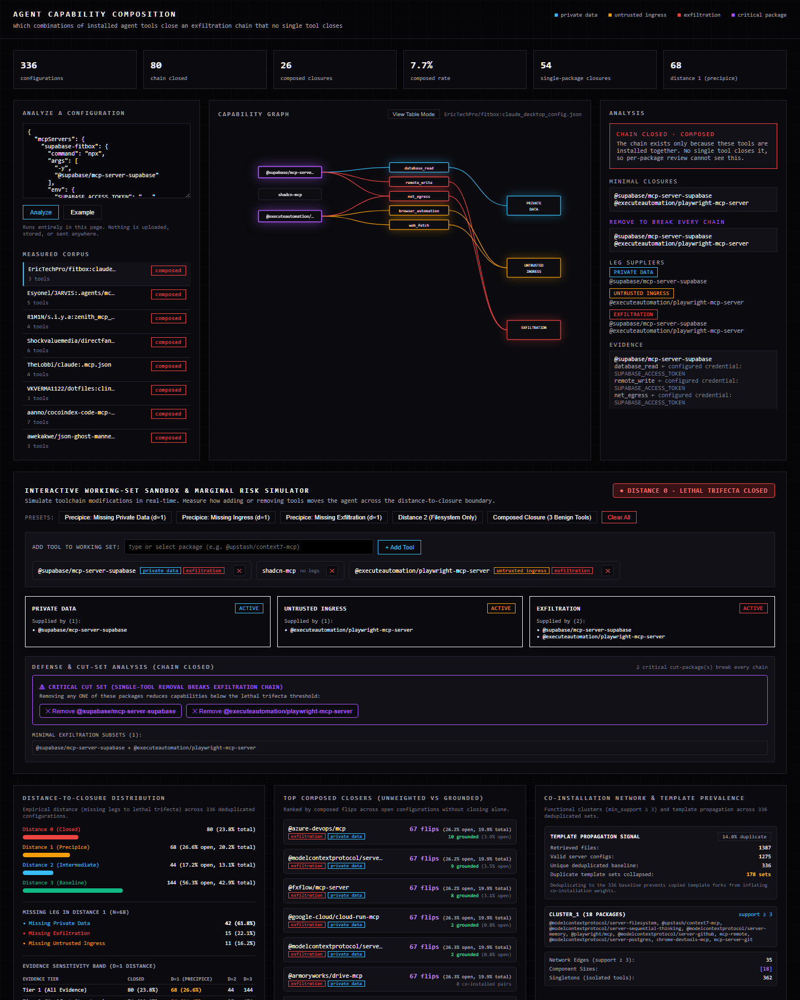
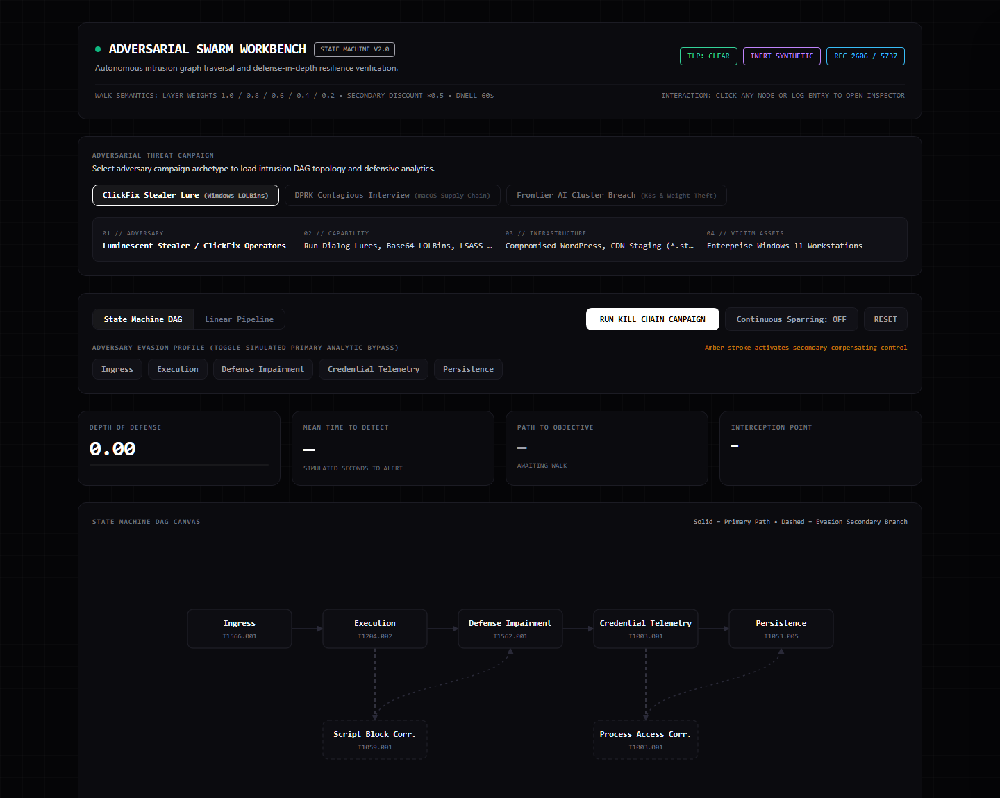
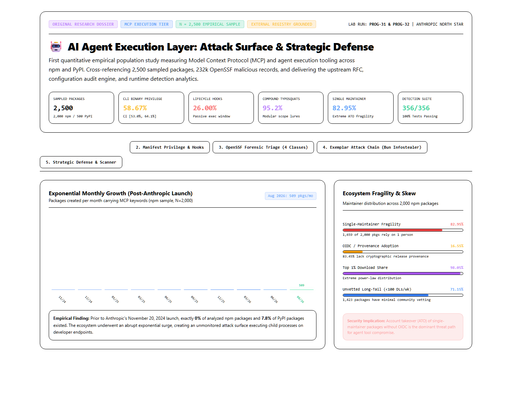

# Threat Detection Lab

A public-safe, test-driven detection engineering and AI agent execution security lab.

> **"What changes if I add this tool to my agent?"**
>
> Most agent tools appear harmless in isolation. Risk emerges through **capability composition**: connecting a routine web fetcher alongside an outbound communication tool and a local filesystem reader completes the lethal trifecta (Private Data + Untrusted Ingress + Exfiltration), creating an autonomous exfiltration path without requiring a software vulnerability.

---

### Quick Start: Agent Exposure Review

Evaluate the composition impact of adding any candidate tool to an agent configuration before installing it:

```powershell
# Review adding filesystem access to the built-in reference agent:
python -m tools.agent_graph.exposure_review --tool @modelcontextprotocol/server-filesystem --args /
```

To review against your own agent configuration (e.g., Claude Desktop, Cursor, or custom JSON):
```powershell
python -m tools.agent_graph.exposure_review --config "$env:APPDATA\Claude\claude_desktop_config.json" --tool @modelcontextprotocol/server-filesystem --args /
```

Output evaluates:
1. **Immediate Verdict:** Did the addition flip an open posture to a closed lethal trifecta?
2. **Configuration Delta:** Before vs. after distance to closure and missing capability legs.
3. **Exfiltration Paths:** Modeled composition paths if closure occurs.
4. **Concrete Mitigations:** Argument-level path scoping, dual-profile architectural separation, and version pinning.

## Interactive artifacts

Static, self-contained pages — no external scripts or runtime fetches (guarded by
`tests/test_artifact_self_containment.py`). Live via GitHub Pages:
**https://kylereid1017.github.io/threat-detection-lab/**

**Agent Exposure Review** — paste an agent configuration; see the capability graph, the closure, and a removal that breaks every chain.
[](https://kylereid1017.github.io/threat-detection-lab/docs/research/agent-capability-composition.html)

**Detection Boundary Workbench** — walk the kill-chain DAG from the deterministic mutation harness.
[](https://kylereid1017.github.io/threat-detection-lab/swarm_workbench.html)

**AI Agent Execution Layer dossier** — the MCP population study as a five-tab dashboard.
[](https://kylereid1017.github.io/threat-detection-lab/docs/research/agent-execution-layer-dashboard.html)

---

## Status & Governance Matrix

| Capability Area | Lifecycle Status | Empirical Evidence & Test Coverage | Operational Constraints & Caveats |
|---|---|---|---|
| **Agent Exposure Review & Composition** | **Verified** | `tools/agent_graph/` (91–99% coverage), 545 passing unit tests in CI. Evaluated across 336 real public configurations. | Static analysis taxonomy (P=0.73, R=0.53); measures potential capability co-occurrence across static configurations, not runtime telemetry. |
| **Detection Engineering & Swarm Sparring** | **Verified** | 5 production Sigma/YARA rules; closed-loop multi-campaign DAG engine with zero false positives on 1,755 benign manifests and 2,079 SVGs. | Closed-loop mutations test detection boundaries; does not represent live adversary operational campaigns. |
| **CTI Collection & Protected Names** | **Verified** | `tools/cti/` pipeline (96–99% coverage), Certificate Transparency live acquisition, inventory-derived typosquat detection evaluated on 232k OpenSSF records. | Zero recall on packages outside local inventory; complete SBOM is a prerequisite. |
| **Host Confinement & Agent Sandbox** | **Experimental (Linux/macOS) / Blocked (Windows)** | Bubblewrap (`bwrap`) on Linux, Seatbelt (`sandbox-exec`) on macOS. | Windows provides advisory environment sanitization and isolated temp trees; **disclaims kernel-level containment** without virtualization/JobObjects. |
| **Dynamic Sandboxed Live Malware Execution** | **Deferred** | Static analysis, manifest audits, and synthetic telemetry fixtures only. | Strict safety policy: zero unvetted binary execution or payload downloads. |

---

## Detections

### 1. File Inspection: Suspicious active-content SVG attachments (YARA)
Targets SVG email attachments combining script execution/event handlers, navigation behavior, and external destinations commonly associated with credential-phishing redirects. See `docs/detections/suspicious-active-content-svg.md`.

### 2. Supply Chain: Malicious package lifecycle hooks (YARA)
Targets inbound `package.json` and `setup.py` manifests combining lifecycle execution hooks (`postinstall`, `preinstall`, `cmdclass`) with encoded execution cradles or remote downloaders, modeling DPRK Famous Chollima supply chain lures. Measured at 0 false positives on 1,755 real benign manifests after a value-scoping fix; see `docs/detections/developer-package-lifecycle-hooks.md`.

### 3. Endpoint Process Creation: Explorer ClickFix execution (Sigma)
Targets user-assisted host execution common in ClickFix, ClearFake, and social-engineering campaigns where users paste malicious downloaders into the Windows Run dialog (`Win + R`). See `docs/detections/explorer-clickfix-execution.md`.

### 4. Workstation Credential Access: macOS developer credential theft (Sigma)
Targets developer runtimes (`node`, `python`, `sh`, `bash`, `osascript`) accessing sensitive developer credentials (`~/.aws/credentials`, `~/.ssh/id_rsa`, Chrome cookie databases). See `docs/detections/macos-developer-credential-theft.md`.

### 5. Cloud AI Cluster Defense: IMDSv2 abuse and S3 model weight exfiltration (Sigma)
Targets container breakout primitives (`nsenter`), EC2 Instance Metadata Service (IMDSv2) token requests for GPU node roles, and anomalous high-bandwidth S3 model checkpoint exfiltration (`*.safetensors`). This is the execution-layer tripwire only; the control-plane detections are in `rules/sigma/cloud/`. See `docs/detections/cloud-imds-checkpoint-exfiltration.md`.

### 6. Cloud Control Plane: CloudTrail and Kubernetes audit detections (Sigma)

Five rules reading the telemetry where cloud activity is actually recorded, rather than
inferring it from command lines: node role credentials replayed from outside the cluster
network, checkpoint object retrieval by a principal that is not the training pipeline, role
chaining from a workload role, privileged or host-namespace pod creation, and interactive
exec into a running training workload. See `rules/sigma/cloud/`.

## CTI Collection and Enrichment Pipeline

A collection layer (`tools/cti/`) that normalizes Certificate Transparency entries, package
registry publications, and malicious URL feeds into one indicator model, deduplicates across
sources, scores each observable against a frontier AI lab threat model, pivots on shared
infrastructure, and emits a STIX 2.1 bundle, a SIEM lookup table, and draft detection rules.

Confidence and relevance are scored separately. Every indicator carries an expiry. Every
relevance point is attributable to a stated reason. Generated rules are marked unsupported
and carry a retirement date. See `docs/cti/README.md` for the design decisions and the
measured behavior, including what the measurement does not establish.

```powershell
python -m tools.cti.cli --snapshots tests/fixtures/cti/snapshots --out docs/cti/results
python -m tools.cti.cli --score anthropic-careers.invalid
```

## Detection Durability Benchmark

`tools/brittleness/` scores any Sigma corpus for the dependencies that quietly make rules stop
working, and `tools/telemetry_coverage.py` maps where a corpus's coverage actually sits per
ATT&CK technique. Both run against corpora this repository did not write; results for 3,144
public SigmaHQ rules are in `docs/brittleness/`.

```powershell
python -m tools.brittleness.cli --git-corpus https://github.com/SigmaHQ/sigma --path-prefix rules/
python -m tools.telemetry_coverage --git-corpus https://github.com/SigmaHQ/sigma --path-prefix rules/
```

## Measurement policy

Two kinds of numbers appear in this repository and they are not interchangeable.

**External measurements** come from data this repository did not author. They are the only
figures that support a claim about real-world behavior. Current external measurements:

| Measurement | Result |
|---|---|
| Package hook rule, false positives on 1,755 real benign manifests | 0 (95% Wilson CI upper bound 0.22%) |
| SVG rule, false positives on 2,079 Bootstrap Icons files | 0 |
| AI-toolchain imitation among 221,033 real malicious npm packages | 0.384% |
| AI-toolchain imitation among 11,696 real malicious PyPI packages | 3.052% |
| Relevance scorer recall, vocabulary approach, held out | 0 of 877 |
| Relevance scorer recall, inventory approach, npm | 61.6% at 2.56% false positives |

The full external validation, including the three defects it exposed and the operating
characteristic that recall equals dependency-inventory coverage, is in
`docs/detections/RECALL.md`.

**Internal measurements** come from the boundary harness probing rules this repository
wrote, using mutations this repository generated. They are regression and boundary-tracking
signals. A confidence interval over them describes sampling error inside a closed system,
not evasion resistance in the field, and it is not evidence that a rule survives real
adversaries.

The endurance harness keeps an append-only observation ledger
(`docs/swarm/results/records/`: one JSONL record per evaluated probe, campaign stage,
DAG visit, replay sweep, and noise benchmark, each with run id, rule hash, fixture
hash, outcome, axis, and timestamp). Every published aggregate is derived from that
ledger and reconciles back to it:

- **Resilience denominator:** attack variants that passed the safety gate and were
  evaluated (detections + evasions). Benign observations are counted separately and
  never enter the denominator.
- **Benign events** (enterprise noise floor, benign telemetry replay) are reported
  separately as false-positive counts; they are not probes and do not inflate N.
- **Blocked proposals** (safety-gate rejections) and evaluation errors are preserved
  in the ledger but excluded from every rate.
- **An empty denominator produces no figure.** A rate with nothing to divide by is
  reported as not measured, never as 0 or 1.

## Detection Boundary Harness

A sandboxed, deterministic testing harness (`tools/swarm/`) implementing a closed feedback loop across specialized roles (Craftsmen, Critic, Detectors, Analyst, Adapter) that systematically probes detection boundaries across structural, syntactic, and LOLBin evasion axes. Every mutation, safety gate, and verdict is deterministic code; no language model runs in the loop.

### Multi-Campaign Intrusion Archetypes
The harness models three canonical adversary campaigns:
1. **ClickFix Stealer Lure:** Windows endpoint intrusion via Explorer Run prompt, PowerShell cradles, and LSASS dumping.
2. **DPRK Contagious Interview:** AI developer supply chain compromise (`package.json` hooks), macOS workstation credential harvesting, and AWS STS operationalization.
3. **Frontier AI Cluster Breach:** GPU compute cluster compromise via container breakout (`nsenter`), IMDSv2 worker role theft, and S3 model weight exfiltration.

## Repository layout

- `rules/yara/` — YARA rules (active content SVG, supply chain hooks)
- `rules/sigma/` — Sigma rules (process creation, macOS credential theft, cloud cluster defense)
- `rules/sigma/cloud/` — CloudTrail and Kubernetes audit control-plane rules
- `rules/sigma/correlation/` — multi-event temporal correlation rules
- `tools/cti/` — CTI collection, enrichment, pivoting, and operationalization pipeline
- `tools/swarm/` — deterministic mutation craftsmen and the closed-loop boundary testing engine
- `tools/swarm/craftsmen/` — specialized adversarial generators (`ProcessCraftsman`, `SvgCraftsman`, `SupplyChainCraftsman`, `CloudClusterCraftsman`)
- `docs/cables/` — structured threat intelligence cables (ICD 203 / Sherman Kent doctrine)
- `docs/research/` — original research notes
- `docs/detections/` — methodology, rationale, limitations, and ATT&CK mapping
- `docs/swarm/` — architecture notes and empirical boundary maps
- `tests/fixtures/` — inert synthetic samples and telemetry events (positive and negative)
- `tests/test_yara_rules.py` — YARA regression tests
- `tests/test_sigma_rules.py` — Sigma schema validation, regression tests, and SIEM conversion tests
- `tests/test_swarm.py` — Swarm safety gates, mutators, and orchestration tests
- `tests/test_multi_campaign_graphs.py` — Multi-campaign DAG state machine regression suite
- `docs/assets/` — vendored assets (single Tailwind build) and README screenshots
- `index.html` — landing page for the interactive artifacts
- `ROADMAP.md` — project delivery roadmap

## Run locally

Requires Python 3.11+.

```powershell
python -m pip install -r requirements-dev.txt

# Run all unit and regression tests (YARA, Sigma, Swarm)
python -m unittest discover -s tests -v

# Run the boundary harness against detections (closed-loop)
python -m tools.swarm.cli --target yara --max-cycles 3
python -m tools.swarm.cli --target sigma --max-cycles 3

# Run continuous sparring with the patch-proposal loop (candidate patches + cables for verified ones)
python -m tools.swarm.cli --target sigma --continuous --iterations 10 --propose-patches

# Run simulated multi-stage intrusion campaign across 5 MITRE ATT&CK stages
python -m tools.swarm.cli --campaign infostealer

# Synthesize accumulated threat cables into an ICD 203 Strategic Intelligence Cable
python -m tools.swarm.cli --synthesize-trends

# Test a custom threat simulation prompt
python -m tools.swarm.cli --target sigma --prompt "Test PowerShell execution with short -w h switch"

# Walk the DAG correlation state machine (defense-in-depth, DoD + MTTD scoring)
python -m tools.swarm.cli --graph --iterations 6

# Run the deterministic zero-false-positive validation gate (ICD 203 summary)
python -m tools.swarm.cli --validate-gate

# Export a MITRE ATT&CK Navigator coverage layer (docs/swarm/results/layer.json)
python -m tools.swarm.cli --export-layer

# Benchmark signal-to-noise against a high-volume benign enterprise corpus
python -m tools.swarm.cli --benchmark-snr --events 2500

# Profile query cost across CrowdStrike LogScale, Splunk SPL, and Elastic Lucene
python -m tools.swarm.cli --profile-siem

# Export the dual-layer MITRE ATT&CK / D3FEND countermeasure matrix
python -m tools.swarm.cli --export-d3fend
```

Open `swarm_workbench.html` in a browser for the interactive state-machine DAG canvas,
which animates a kill-chain walk, branches to secondary telemetry paths on evasion, and
reports live Depth-of-Defense, Mean Time-to-Detect, and Path-to-Objective metrics.

### Detection-as-Code platform (`tools/swarm/`)

The harness is a graph-based, continuously validated Detection-as-Code platform:

- **`telemetry_generator.py`** — schema-driven builder for inert Windows telemetry (Sysmon EID 1 / Security 4688 and correlation event families 7, 10, 11, 4104) with programmatic command-line mutation (argument reordering, integer switch aliases, whitespace, wrapper hosts). Every record is validated against RFC 2606 / RFC 5737 reserved endpoints before evaluation.
- **`graph_engine.py`** — a directed-acyclic-graph state machine over the intrusion lifecycle (Ingress → Execution → Defense Impairment → Credential Telemetry → Persistence). On a primary-analytic miss it branches to an adjacent secondary telemetry path and scores Depth-of-Defense, Mean Time-to-Detect, and path-to-objective containment.
- **`evaluator.py`** — a multi-event Sigma evaluator with temporal correlation windows, requiring several component detections to fire in order within a bounded timespan. Correlation component rules live in `rules/sigma/correlation/`.
- **`validate_gate.py`** / **`export_layer.py`** — the zero-false-positive CI gate and the ATT&CK Navigator layer exporter, wired into `.github/workflows/detection-validation.yml`.
- **`noise_floor.py`** — generates a high-volume corpus of realistic benign Windows background telemetry (Defender, Intune, SCCM, maintenance, administrative PowerShell) and computes precision, recall, F1, and false discovery rate against it. Per-analytic recall is scored only over the events each analytic owns, and corpus metrics are counted per event rather than pooled across rules. The corpus deliberately includes ambiguous administrative activity that genuinely resembles attacker tradecraft, because that is what produces real false positives.
- **`siem_profiler.py`** — compiles every analytic to LogScale, Splunk, and Lucene, then statically scores query cost, flagging leading wildcards, unanchored regexes, and wide OR expansions.
- **`d3fend_mapper.py`** — crosswalks covered ATT&CK techniques onto MITRE D3FEND countermeasures and emits a dual-layer matrix. Mappings carry provenance, and identifier collisions are reported rather than silently resolved.
- **`swarm_workbench.html`** — the interactive state-machine DAG canvas. Its walk constants are regression-tested against the Python engine so the visualiser cannot silently drift from the code it depicts.

## Safety and provenance

This repository uses public sources, public tools, and inert synthetic fixtures only. It contains no employer data, customer data, internal metrics, internal terminology, credentials, or live malicious payloads.

## Status

Experimental. These detections are transparent lab exercises, not production security controls. See detection methodology notes for operational assumptions and limitations.

## Threat Intelligence & Research

- [CABLE-2026-001: Adversary Initial Access Analysis: Multi-Stage ClickFix Social Engineering and Active-Content SVG Lures Delivering InfoStealer Malware](docs/cables/CABLE-2026-001-clickfix-initial-access.md) — comprehensive campaign analysis, Diamond Model mapping, facts vs. judgments matrix, and MITRE ATT&CK alignment.
- [Active Content in SVG Phishing Attachments: Detection Opportunities and Evasion Tradeoffs](docs/research/active-content-svg-phishing.md) — original research note: mechanism, tested detection, measured results, evasion tradeoffs, and layered defenses.
