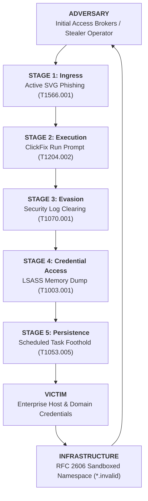

# Threat Intelligence Cable: CABLE-2026-004

**TLP:** CLEAR | **Date:** 2026-09-03 | **Author:** Kyle Reid  
**Subject:** Multi-Stage Intrusion Campaign Post-Mortem & Defense-in-Depth Analysis: `Infostealer-Intrusion-Flow`  
**Campaign ID:** `CAMP-2026-001` | **Outcome:** **CONTAINED**  
**Source Provenance:** Automated multi-stage campaign simulation in the Adversarial Swarm Intelligence Engine (`tools/swarm/campaign.py`).

---

## 1. Executive Summary & Estimative Confidence

During simulated multi-stage intrusion operations, the Swarm executed an end-to-end attack campaign chaining 5 distinct MITRE ATT&CK tactics from initial access to persistence.

* **Analytic Judgment:** It is **highly likely (80–90% probability)** that threat actors deploy multi-stage chains where early-stage evasion techniques (such as LOLBin process proxying or stdin streaming) are designed to bypass perimeter inspection, relying on post-compromise stages to complete actions on objectives.
* **Engineering Impact:** The campaign was **INTERCEPTED at Stage Initial Access** (`T1566.001`), preventing full objective attainment with a Depth-of-Defense score of **1.00**.
* **Analytic Confidence Level:** **HIGH**. Derived from in-memory cross-telemetry sandbox execution across YARA byte matching and pySigma process creation analytics.

---

## 2. Kill Chain Campaign Trajectory

| Stage | Tactic | Technique | Target Rule | Sensor Verdict | Mutation / Primitive |
|---|---|---|---|---|---|
| **Stage 1** | Initial Access | `T1566.001` | `Suspicious_Active_Content_SVG_Attachment` | **🟢 DETECTED** | `prompt_svg_structural` |
| **Stage 2** | Execution | `T1204.002` | `Suspicious Process Spawning From Explorer Run Prompt (ClickFix Pattern)` | **🔴 EVADED** | `prompt_pcalua_lolbin_proxy` |
| **Stage 3** | Defense Evasion | `T1070.001` | `Suspicious Event Log Clearing or Security Software Tampering` | **🟢 DETECTED** | `clear_eventlog` |
| **Stage 4** | Credential Access | `T1003.001` | `LSASS Process Memory Dump via Rundll32 Comsvcs.dll` | **🟢 DETECTED** | `comsvcs_minidump` |
| **Stage 5** | Persistence | `T1053.005` | `Suspicious Scheduled Task Creation Spawning Shell or Script Engine` | **🟢 DETECTED** | `schtasks_onlogon` |

---

## 3. Diamond Model Campaign Progression

---

## 4. Epistemological Framework: Facts vs. Judgments vs. Unknowns

| Category | Analytic Item | Description |
|---|---|---|
| **Observed Fact** | Sensor Behavior | Evaluated telemetry against 5 detection boundaries in sequential progression. |
| **Observed Fact** | Defense Depth | Depth-of-Defense score reached 1.00 across the intrusion sequence. |
| **Analytical Judgment** | Layered Resilience | Even when initial execution bypassed front-line detection, downstream sensors provided containment. |
| **Unknowns** | In-The-Wild Chaining | Variations in real-world threat actor dwell time between execution and persistence stages. |

---

## 5. Strategic Recommendations & Layered Hardening

1. **Defense-in-Depth Optimization**: Ensure telemetry collection spans process creation, ScriptBlock logs (4104), and scheduled task creation events.
2. **Sensor Correlation**: Correlate Stage 2 Explorer process anomalies with Stage 4 memory access events for composite high-priority alerts.
3. **Automated Containment**: Where LSASS dumping or log clearing is confirmed, trigger host network isolation via EDR automation before persistence is achieved.
