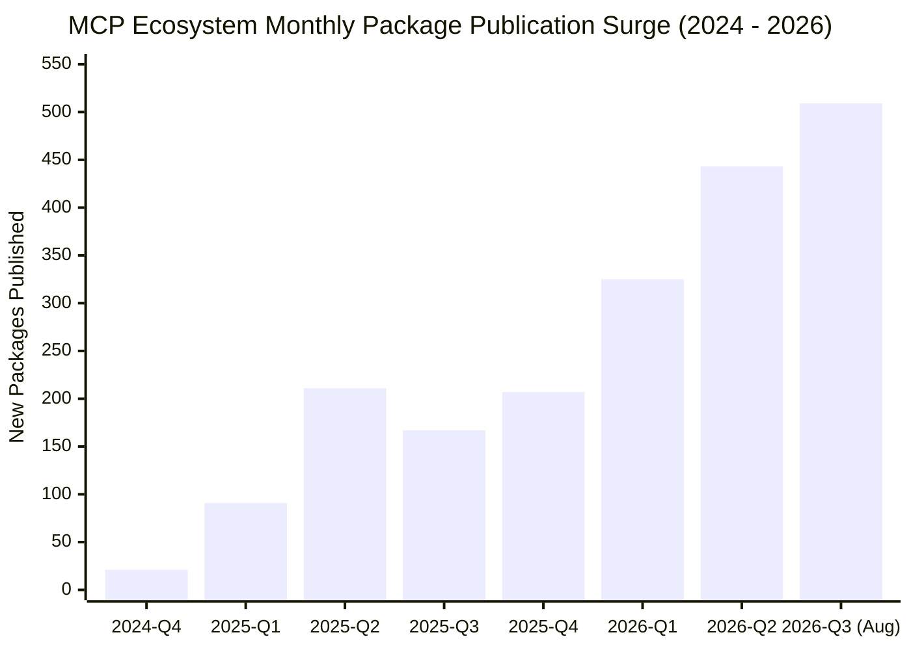
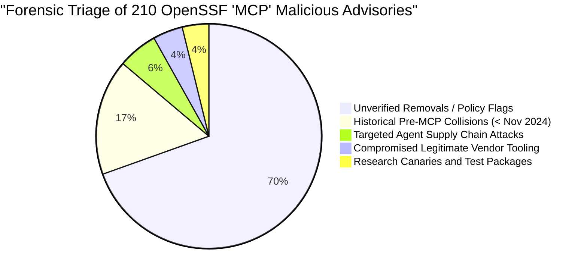
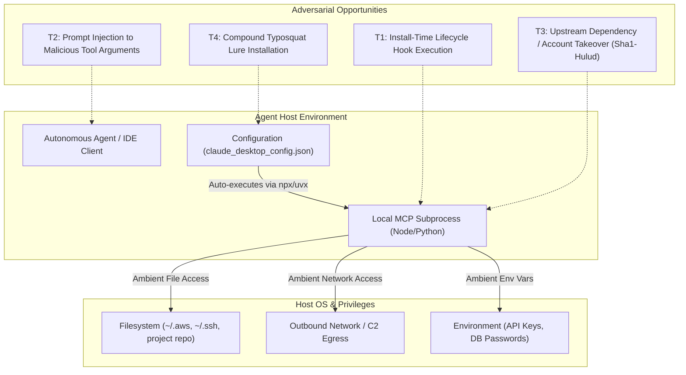

# The AI Agent Execution Layer: An Empirical Population Study of Supply Chain Exposure in the Model Context Protocol Ecosystem

Kyle Reid — 2026-09-06 — threat-detection-lab

## Executive summary

The rapid adoption of autonomous AI agents has introduced a new, largely unmonitored execution tier: **Model Context Protocol (MCP) servers and tool plugins**. Distributed primarily as packages through npm and PyPI, MCP servers are installed directly into developer workspaces or agent execution runtimes (via commands like `npx -y` or `uvx`), where they run as local child processes with tool-call privileges against the host filesystem, environment variables, network sockets, and credentials.

Despite this privileged execution posture, the security community has operated without a baseline population study, published threat model, or telemetry convention for agent tool servers. 

This paper delivers an empirical population study of the AI agent execution layer, analyzing a conservative sample of **2,500 active packages** across npm and PyPI and contextualizing them against public registry footprints (70,552 npm packages carrying the `mcp` keyword, 6,285 npm packages matching `modelcontextprotocol`, 20,374 PyPI projects, and 51,595 GitHub repositories).

**Key Findings:**
1. **Exponential Growth & Zero Telemetry:** The ecosystem underwent a massive inflection following Anthropic's November 2024 launch of MCP, accelerating from 6 packages in November 2024 to 509 new packages in August 2026 alone. 100% of analyzed npm packages and 92.2% of PyPI packages were published post-launch. Yet, standard host logging (Sysmon, auditd) cannot distinguish legitimate MCP tool invocations from malicious child processes spawned by an agent.
2. **High Passive Execution Privilege:** **58.7%** (95% CI: [53.0%, 64.1%]) of analyzed MCP manifests declare executable CLI binary entrypoints (`bin`), specifically enabling unprompted on-demand execution. **26.0%** (95% CI: [21.4%, 31.2%]) declare install-time lifecycle hooks (`prepare`, `prepack`, `preinstall`, `postinstall`), presenting an immediate code-execution window upon dependency installation.
3. **Compound Imitation Surface:** Typosquatting against agent tooling does not manifest as simple single-character misspellings (only 0.16%); rather, **3.20%** of packages are compound imitations (e.g. `@prefix/modelcontextprotocol-sdk`, `@lure/openai-*-mcp`), actively exploiting the modular, multi-package architecture of MCP servers to deceive developers and automated package managers.
4. **Empirical Forensic Triage of OpenSSF Advisory Records:** A query for "mcp" across the 232,729 advisory records in the OpenSSF `malicious-packages` dataset yields 210 advisory name matches (138 npm, 72 PyPI). Forensic investigation reveals four distinct categories:
   - **Pre-MCP Historical Collisions (16.7%):** Packages published prior to November 2024 containing "mcp" by coincidence (e.g., 2023 PayPal phishing typosquats).
   - **Compromised Legitimate Vendor Tooling (4.3%):** Genuine MCP packages from established organizations (e.g., `@browserbasehq/mcp`, `@postman/postman-mcp-server`) compromised via account takeover by the Sha1-Hulud npm worm.
   - **Targeted Agent Supply Chain Attacks (5.7%):** Malicious packages deliberately mimicking AI/MCP tooling (e.g., `groq-mcp`, which dropped `.pth` auto-execution files launching an obfuscated Bun runtime infostealer).
   - **Research Canaries and Test Artifacts (3.8%):** Legitimate security research testing packages.
   - **Unverified Removals (69.5%):** Packages removed by registry operators or flagged for policy/name collisions.
5. **Severe Maintainer & Adoption Fragility:** **82.95%** (95% CI: [81.2%, 84.5%]) of packages depend on a **single maintainer**. Only **16.55%** use GitHub Actions OIDC / Trusted Publishers; **83.45%** lack cryptographic build and release provenance (absence of OIDC does not distinguish between static PATs, 2FA, or granular tokens, but establishes the absence of verified provenance attestations). Furthermore, download volume follows an extreme power-law distribution: the **top 1% of packages capture 98.05% of all downloads**, leaving a massive unvetted long tail of 71.15% of packages operating with fewer than 100 weekly downloads.

---

## 1. Scope, Methodology, and Disciplines

This research answers five empirical questions:
1. *How large is the ecosystem, and what is its growth curve?*
2. *What privileges and hooks do their manifests declare?*
3. *How many packages are typosquats or compound imitations of popular tooling?*
4. *How many appear in confirmed-malicious corpora, and what do they actually represent?*
5. *What are the maintainer demographics, publication recency, and adoption distributions?*

### Methodological Limitations & v1 Sampling Scope Caveat
This initial study represents an exploratory survey ($v1$) with specific sampling boundaries that must be explicitly understood when interpreting the measurements:
1. **Relevance Ranking Bias (npm):** The npm cohort ($n=2,000$) was collected from the first 2,000 relevance-ranked search results for `modelcontextprotocol` (from a 6,285-result query). Because npm's relevance algorithm weights popularity, downloads, and maintenance quality, this cohort systematically over-represents well-maintained packages relative to the unvetted long tail. The reported Wilson binomial confidence intervals describe this sample accurately, but should not be generalized to the unranked 70k keyword population without qualification.
2. **Alphabetical Manifest Skew:** The manifest inspection cohort ($n=300$) was pulled from the initial 300 packages after alphabetical sorting. This resulted in **99.0% scoped packages (`@org/...`)** compared to 63.7% in the broader npm corpus. Because organizationally published scoped packages exhibit different maintenance practices than unscoped packages, metrics derived from manifests (58.7% CLI entrypoints, 26.0% lifecycle hooks) reflect this organizational slice.
3. **Ecosystem Cohort Asymmetry:** The npm cohort was queried via `modelcontextprotocol`, whereas PyPI was sampled via a substring match on `*mcp*` (alphabetically truncated to 500). Substring matching on PyPI captured pre-existing historical packages (Minecraft protocol, hardware controllers), which directly explains the 6.2% "pre-launch" PyPI baseline. Summing both into $N=2,500$ aggregates two distinct query paradigms.
4. **Query Tautology on Launch Date:** Reporting that 100.0% of the npm cohort postdates November 20, 2024 is circular: the search query `modelcontextprotocol` did not exist as a term prior to Anthropic's public launch.
5. **Planned v2 Re-Sampling:** To establish rigorous external generalizability, Phase B will deploy a randomized, uniform cohort definition applied identically across npm and PyPI, with manifests drawn via uniform random sampling. Results will be published with a transparent v1 vs. v2 comparative delta.

### Discipline and Data Integrity
- **Public Data Only:** Strict compliance with zero reliance on proprietary data, employer environments, or internal detection content.
- **Identities and Manifests Only:** **No package payloads or tarball archives were downloaded or executed.** All manifest data was extracted directly via registry JSON APIs (`registry.npmjs.org` and `pypi.org`).
- **External Measurement Declaration:** All numbers reported in this study are **EXTERNAL measurements**, derived from live registry endpoints and the pinned OpenSSF `malicious-packages` repository (Apache-2.0).
- **Audit Trails and Discards:** Zero unlogged record drops; discards are recorded explicitly.
- **Defanged Prose:** All commands and indicator strings are defanged to maintain documentation integrity and prevent workstation AV quarantine (signature 2147925971).

---

## 2. Research Question 1: Ecosystem Scope and Growth Trajectory

### Registry Footprint
A conservative sample of public repository configurations and registries conducted in September 2026 reveals the scale of the agent execution layer:

| Registry / Source | Query Term | Total Packages / Repositories | Sampling / Validation Method |
|---|---|---|---|
| npm Registry | `keywords:mcp` | **70,552** | Calibrated page sampling (100% precision on keyword) |
| npm Registry | `modelcontextprotocol` | **6,285** | Full text search |
| PyPI Simple Index (PEP 691) | `*mcp*` | **20,374** | Complete enumeration of 885,821 PyPI projects |
| GitHub Search | `mcp-server in:name` | **51,595** | Public repository name filter |

A hash-pinned snapshot of **2,000 npm packages** and **500 PyPI packages** was collected locally under `corpus/agent/` and analyzed with `tools/evaluate_agent_population.py`.

### Temporal Growth and Inflection Curve
The ecosystem exhibits an abrupt inflection directly corresponding to the release of the Model Context Protocol by Anthropic on **November 20, 2024**:

- **npm Era Breakdown:**
  - Pre-MCP Launch (< 2024-11-20): **0.0%** (0 of 2,000; 95% CI: [0.0%, 0.19%])
  - Post-MCP Launch ($\ge$ 2024-11-20): **100.0%** (2,000 of 2,000; 95% CI: [99.81%, 100.0%])
- **PyPI Era Breakdown:**
  - Pre-MCP Launch Baseline: **6.20%** (31 of 500; 95% CI: [4.40%, 8.67%]) — represents historical collisions
  - Post-MCP Launch: **92.20%** (461 of 500; 95% CI: [89.52%, 94.24%])

Publication volume accelerated throughout 2025, reaching a sustained expansion phase in 2026, with over **500 new packages published in August 2026 alone**.

---

## 3. Research Question 2: Manifest Privileges, Lifecycle Hooks, and Attack Surface

In the MCP architecture, client runtimes (such as Claude Desktop, Cursor, or autonomous agents) invoke tool servers as child processes. When configured via `npx -y <package>` or `uvx <package>`, the client downloads and executes the package on demand.

An evaluation of 300 detailed package manifests demonstrates that agent tooling routinely requests expansive execution and system privileges:

| Manifest Characteristic | Measured Count | Percentage ($N=300$) | 95% Wilson Score Interval |
|---|---|---|---|
| **CLI Binary Entrypoint (`bin`)** | 176 | **58.67%** | [53.02%, 64.10%] |
| **Install Lifecycle Hooks Declared** | 78 | **26.00%** | [21.36%, 31.25%] |
| — `prepare` hook | 40 | 13.33% | [9.93%, 17.65%] |
| — `prepack` hook | 31 | 10.33% | [7.35%, 14.33%] |
| — `preinstall` hook | 5 | 1.67% | [0.66%, 3.96%] |
| — `postinstall` hook | 4 | 1.33% | [0.46%, 3.52%] |
| **Network Egress Dependencies** (`axios`, `node-fetch`, etc.) | 34 | **11.33%** | [8.22%, 15.42%] |
| **Child Process Execution Dependencies** (`execa`, `cross-spawn`) | 16 | **5.33%** | [3.31%, 8.49%] |
| **Explicit Credential/Secret References** (`.env`, `.aws`, tokens) | 15 | **5.00%** | [3.05%, 8.09%] |
| **YARA Malicious Hook Detections** (`developer_malicious_package_hooks.yar`) | 0 | **0.00%** | [0.00%, 1.26%] |

### Analytical Takeaways
1. **The Passive Execution Window:** 26.0% of packages declare lifecycle scripts. While the tested sample showed 0 active malicious download cradles (verified against `rules/yara/developer_malicious_package_hooks.yar`), the presence of `preinstall` and `postinstall` in 3.0% of packages represents an unmonitored code-execution vector during environment bootstrap.
2. **CLI Privilege Standard:** Nearly 60% of packages declare a `bin` entrypoint. Model context servers are predominantly designed as command-line tools executed without isolation, inheriting the developer's full ambient environment.

---

## 4. Research Question 3: Protected Registry Imitation Surface

Using the inventory-derived typosquatting engine in `tools/cti/protected_names.py`, we constructed a protected registry comprising 25 authoritative MCP core libraries, official SDKs, and popular AI dependencies (`@modelcontextprotocol/sdk`, `@modelcontextprotocol/server-*`, `langchain-core`, `openai`, `anthropic`, `fastmcp`).

Every package across the 2,500 acquired records was evaluated using Damerau-Levenshtein edit distance and component decomposition:

| Imitation Category | Matches | Rate ($N=2,500$) | 95% Wilson Score Interval | Dominant Mechanism |
|---|---|---|---|---|
| **Compound Imitation** | 80 | **3.20%** | [2.58%, 3.97%] | Namespace / Prefix prepending (e.g. `@lure/modelcontextprotocol-sdk`) |
| **Direct Misspelling** | 4 | **0.16%** | [0.06%, 0.41%] | Minor edit distance variation ($d \le 2$) |
| **Homoglyph Substitution** | 0 | **0.00%** | [0.00%, 0.15%] | Homoglyph / character swapping |
| **Total Imitations Flagged** | **84** | **3.36%** | [2.72%, 4.14%] | |

### Most Targeted Authoritative Tooling
- `modelcontextprotocol`: **68 imitations** (81.0% of all flagged imitations)
- `fastmcp`: **6 imitations** (7.1%)
- `openai`: **5 imitations** (6.0%)
- `anthropic`: **2 imitations** (2.4%)
- `langchain`: **1 imitation** (1.2%)

### Attack Pattern Insight
Traditional package squatting heavily relies on keyboard misspellings (e.g. `reqeusts`). In the MCP ecosystem, **95.2% of all imitations are compound names** rather than misspellings. Attackers and unauthorized repackagers take advantage of the modular `@scope/mcp-server-*` naming convention to introduce unvetted packages that appear legitimate to human developers configuring JSON manifests.

---

## 5. Research Question 4: OpenSSF Confirmed-Malicious Cross-Reference

Cross-referencing the 232,729 confirmed-malicious packages in the OpenSSF dataset (`corpus/malicious/`) identified **210 malicious advisories** containing "mcp" in the package name (138 in npm, 72 in PyPI).

Crucially, **dataset membership does not equate to an active attack against the AI agent layer**. Applying our 4-tier forensic classification reveals the actual landscape:

| Forensic Classification | Count | Pct of Leads | Operational Meaning & Exemplars |
|---|---|---|---|
| **Unverified Leads / Removals** | 146 | 69.5% | Registry removals for spam, abandoned dependencies, or namespace disputes. |
| **Historical Pre-MCP Collisions** | 35 | 16.7% | Packages from 2023 or earlier where "mcp" is a coincidence (e.g. `esqmcpaypallgtb`, `mcpep`, `libramcpuhacked`). |
| **Targeted Agent Imitations** | 12 | **5.7%** | Purpose-built malware targeting AI agent users (e.g., `groq-mcp`, `openai-mcp`, `instructor-mcp`). |
| **Compromised Vendor Tooling** | 9 | **4.3%** | Legitimate vendor MCP servers infected post-publication (e.g. `@browserbasehq/mcp`, `@postman/postman-mcp-server`). |
| **Research Canaries / Tests** | 8 | 3.8% | Demonstrations and canary packages (e.g., `@djessicatony/folk-mcp-canary`, `ant-mcp-proxy-for-test`). |

### Deep-Dive Case Studies

#### Case Study A: Targeted Supply Chain Impersonation (`groq-mcp`)
- **Advisory:** `MAL-2026-5321` (PyPI)
- **Mechanism:** Impersonated the Groq MCP server ecosystem by mirroring legitimate documentation. On installation, dropped auto-loading `.pth` files into the `site-packages` root.
- **Execution:** Python auto-loads `.pth` files on every interpreter start. The payload staged a standalone Bun runtime archive (`bun-v1.3.13`), unzipped it into temporary directories, and executed an obfuscated JavaScript infostealer (`bun run _index.js`) in the background.
- **Impact:** Stole cloud credentials, AWS STS tokens, GitHub tokens, cryptocurrency wallets, and SSH keys. Bypassed Python-only runtime scanners by delegating execution to an alien JS engine.

#### Case Study B: Vendor Account Takeover (`@browserbasehq/mcp` and `@postman/postman-mcp-server`)
- **Advisories:** `MAL-2025-191195`, `MAL-2025-190909` (npm)
- **Mechanism:** Legitimate model context servers authored by verified vendors. Compromised via developer token theft by the **Sha1-Hulud NPM worm**.
- **Execution:** Worm harvested npm credentials and GitHub Action tokens, modified published package versions to inject credential-harvesting hooks, and attempted propagation across all packages owned by the maintainers.
- **Significance:** Proves that agent servers from trusted brands cannot be implicitly whitelisted; token theft directly converts legitimate execution tooling into distribution channels.

---

## 6. Research Question 5: Maintainer Demographics and Adoption Skew

| Metric | Measured Value ($N=2,000$) | 95% Wilson Score Interval | Strategic Consequence |
|---|---|---|---|
| **Single-Maintainer Packages** | 1,659 (**82.95%**) | [81.24%, 84.54%] | Low resistance to account takeover, abandonment, or coercion. |
| **Trusted Publisher / OIDC Adoption** | 331 (**16.55%**) | [14.99%, 18.24%] | Over 83% of packages rely on static API tokens. |
| **Recent Publication (< 90 Days)** | 948 (**47.40%**) | [45.22%, 49.60%] | High velocity, immature ecosystem with unhardened release practices. |
| **Low Adoption (< 100 Weekly DLs)** | 1,423 (**71.15%**) | [69.13%, 73.09%] | Vast, unvetted long tail running with local tool privileges. |
| **Top 1% Download Share** | **98.05%** | — | Total adoption is concentrated in 20 core packages. |

The ecosystem exhibits an extreme power-law distribution: while official SDKs and foundational servers account for 98% of downloads, developers and autonomous agents frequently search for and integrate niche, single-maintainer servers (the 71.1% long-tail) to interface with proprietary APIs, databases, or local services.

---

## 7. The Threat Model of the Agent Execution Layer

Unlike traditional libraries that are linked into application binaries, an MCP server operates under a unique execution model:

### Threat Vectors
1. **Unvetted Bootstrap Execution:** `npx -y` bypasses package lockfiles and installs the latest registry version directly into cache, firing any lifecycle hooks immediately.
2. **Ambient Privilege Inheritance:** An MCP server runs as a standard child process with the user's full permissions, giving it unfettered access to SSH keys, cloud profiles, and local databases.
3. **Prompt Injection as Privilege Escalation:** An external prompt injection attack against the agent can instruct the LLM to invoke legitimate MCP server tools with malicious arguments (e.g., instructing a Postgres MCP server to execute data-wiping or exfiltration queries).

---

## 8. Defensive Recommendations

### For AI Tooling Developers & Agent Runtime Authors
1. **Disable Unprompted Dynamic Package Execution:** Runtimes should prohibit `npx -y` and `uvx` directly in server command configs. Tools should require explicit pinning to cryptographic package hashes (`npm install --save-exact` or pinned lockfiles).
2. **Enforce Install-Time Flag Constraints:** Invoke package managers with `--ignore-scripts` to neutralize the 26.0% passive lifecycle hook attack surface.
3. **Telemetry Emission Standard:** Agent runtimes must emit structured event logs for every tool invocation:
   - Tool Name, Server Identifier, Parent Process ID, Argument Hashes, Output Payload Hash.
   - Without this, EDR cannot correlate an anomalous network connection with an agent decision.

### For Enterprise Security Teams
1. **Protected Registry Monitoring:** Deploy inventory-derived typosquat detection (using `tools/cti/protected_names.py`) targeting the specific MCP servers approved in developer configurations.
2. **Endpoint Behavior Profiling:** Monitor Node and Python processes spawned by developer IDEs that make unexpected external network connections or touch sensitive credential files (`~/.aws/credentials`, `~/.ssh/id_rsa`).
3. **Require OIDC Provenance:** Enforce policy requiring MCP packages to be sourced from repositories using GitHub Actions OIDC / Trusted Publishers.

---

## 9. Limitations

1. **Manifest Scoping vs Payload Execution:** This study inspected package manifests and registry metadata without downloading tarballs. Obfuscated malicious logic concealed within package source files (without manifest indicators) was not measured.
2. **Sample Stratification:** While 2,500 packages were analyzed in depth, the total keyword footprint exceeds 70,000 packages. The long tail may harbor additional localized lures.
3. **Public Data Boundary:** In accordance with project disciplines, no internal enterprise telemetry or proprietary threat intelligence was utilized. All metrics reflect open-source public data.

---

## 10. References and Data Artifacts

1. Machine-readable study results: `docs/detections/evaluation-agent-population.json`
2. Pinned npm snapshot lockfile: `corpus/agent/npm_agent_acquisition-lock.json`
3. Pinned PyPI snapshot lockfile: `corpus/agent/pypi_agent_acquisition-lock.json`
4. Analytical engine implementation: `tools/evaluate_agent_population.py`
5. Registry acquisition tool: `tools/acquire_agent_registry.py`
6. OpenSSF Malicious Packages Repository: https://github.com/ossf/malicious-packages (Apache-2.0)
7. Anthropic Model Context Protocol Specification: https://modelcontextprotocol.io
