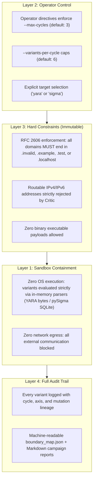
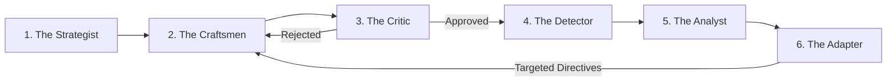

# Adversarial Swarm Intelligence Engine

## Overview

Traditional detection engineering is fundamentally reactive:
1. An adversary launches a campaign.
2. Detection teams observe customer impact or public reporting.
3. Engineers author a signature or rule matching the observed variant.
4. Adversaries introduce minor mutations, evading the new rule.
5. The cycle repeats.

The **Adversarial Swarm Intelligence Engine** is a controlled, sandboxed multi-agent testing harness designed to break this reactive treadmill. By organizing specialized adversarial agents along structural, syntactic, and behavioral evasion axes, the swarm autonomously maps the detection boundaries of detection rules before adversaries discover them in production.

This architecture is an open-source, test-driven implementation of the multi-agent red team paradigm originally formulated by Kyle Reid in February 2026 (*"Adversarial Swarm Intelligence: Controlled Multi-Agent Red Team for Continuous Detection Boundary Testing"*).

---

## The 4-Layer Safety Architecture

Adversarial testing must never introduce uncontained risks. The swarm enforces safety at four distinct architectural boundaries:



---

## The 5 Agent Roles

Rather than prompting a single LLM to generate generic variants, the swarm decouples the testing process into specialized functional roles:



1. **The Strategist**: Receives operator directives (`OperatorDirective`), establishes testing hypotheses, and decomposes testing objectives across targeted evasion axes (structural, syntactic, LOLBin substitution, obfuscation).
2. **The Craftsmen**: Specialized generation modules that produce concrete test variants along specific technical dimensions:
   - `SvgCraftsman`: Explores XML structural variations, namespace prefixing (`<svg:svg>`), comment padding, CDATA encapsulation, event handlers (`onload`, `onerror`), and JavaScript navigation primitives.
   - `ProcessCraftsman`: Explores Windows process creation variations, switch aliasing (`-w 1`, `-w h`), base64 encoding (`-enc`), background staging (`start /b`), LOLBin substitutions (`rundll32`, `wscript`, `curl`), and cmdlet splitting.
3. **The Critic**: The mandatory pre-flight gate. Before any variant reaches the detector, the Critic verifies:
   - Syntax validity: parses XML/SVG via `ElementTree` and verifies required telemetry fields for process events.
   - Safety boundary compliance: scans all URLs to guarantee adherence to RFC 2606 reserved TLDs (`.invalid`, `.example`) and blocks routable IP addresses.
4. **The Detector**: Executes local detection evaluation against compiled rules in memory:
   - `YaraDetector`: Evaluates byte-level payloads against compiled YARA rules (`rules/yara/`).
   - `SigmaDetector`: Evaluates event dictionaries against Sigma rules converted to SQL queries via `pySigma-backend-sqlite` on in-memory SQLite tables.
5. **The Analyst**: Evaluates detection outcomes, isolates features responsible for rule triggering, and performs root-cause attribution when an evasion succeeds.
6. **The Adapter**: Closes the feedback loop. Synthesizes findings from the current cycle and instructs the Craftsmen on which boundary dimensions to probe in the subsequent cycle.

---

## Measured Boundary Discoveries

In empirical tests against the repository's rules, the swarm mapped the following detection boundaries:

### 1. File Inspection: `Suspicious_Active_Content_SVG_Attachment` (YARA)
* **Resilience Score**: 66.7% (6/9 detected, 3 gaps identified)
* **Discovered Boundaries**:
  1. `structural/svg_comment_padding_exceeding_1kb`: The rule enforces `$svg at 0 or $svg in (0..1024)`. Prepending >1,024 bytes of XML comments pushes the `<svg` root outside the scan window.  
     *Recommendation (`REC-YARA-001`)*: Expand the root search window to 4,096 bytes or pair with a structural XML pre-parser.
  2. `obfuscation/svg_string_concatenation_location`: Literal string matching for `location` and `href` is bypassed when JavaScript constructs properties dynamically (`window['loc'+'ation']['hr'+'ef']`).  
     *Recommendation (`REC-YARA-002`)*: Pair static string matching with AST JavaScript tokenization or dynamic sandbox inspection.
  3. `structural/svg_namespace_prefix_aliasing`: Custom namespace prefixes (`<svg:svg>`) alter the byte representation from literal `<svg`.  
     *Recommendation (`REC-YARA-003`)*: Update regex to accept optional namespace qualifiers: `<([a-zA-Z0-9_-]+:)?svg`.

### 2. Process Telemetry: `proc_creation_win_explorer_clickfix_execution` (Sigma)
* **Resilience Score**: 72.7% (8/11 detected, 3 gaps identified)
* **Discovered Boundaries**:
  1. `obfuscation/proc_powershell_split_invoke_restmethod`: Cmdlet invocation splitting `&('Inv'+'oke-RestMethod')` evades literal `CommandLine|contains` matches.  
     *Recommendation (`REC-SIGMA-002`)*: Layer with PowerShell Script Block Logging (Event ID 4104) to capture deobfuscated tokens.
  2. `lolbin/proc_rundll32_url_protocol_handler`: Explorer spawning `rundll32.exe url.dll,FileProtocolHandler` to trigger remote URLs is not covered by shell-specific filters.  
     *Recommendation (`REC-SIGMA-004`)*: Add `rundll32.exe` executing `url.dll` or `mshtml` to monitored child LOLBins.
  3. `lolbin/proc_wscript_remote_script_fetch`: Explorer spawning `wscript.exe` / `cscript.exe` with remote HTTP(S) destinations.  
     *Recommendation (`REC-SIGMA-005`)*: Add Windows Script Host utilities with remote URIs to monitored child images.

---

## Running the Swarm

Execute the swarm CLI locally:

```powershell
# Evaluate YARA active-content detection
python -m tools.swarm.cli --target yara --max-cycles 3

# Evaluate Sigma process creation detection
python -m tools.swarm.cli --target sigma --max-cycles 3
```

Results are automatically saved to `docs/swarm/results/`:
- `boundary_map_<target>.json`: Machine-readable quantitative boundary map.
- `campaign_report_<target>.md`: Human-readable summary table and tuning recommendations.

---

## Extending the Swarm

To add a new evasion axis or target rule:
1. **New Target Rule**: Add a runner under `tools/swarm/detectors.py` implementing `BaseDetector`.
2. **New Craftsman Mutators**: Subclass `BaseCraftsman` under `tools/swarm/craftsmen/` and implement `generate_variants(cycle, feedback)`.
3. **New Attributions**: Add root-cause heuristics under `tools/swarm/analyst.py`.
