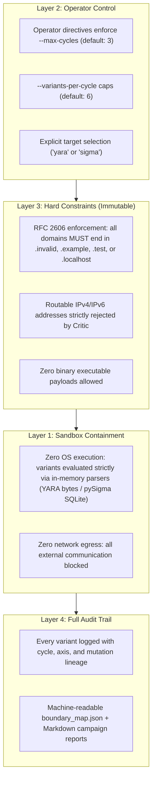
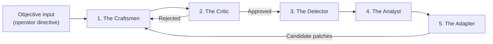

# Detection Boundary Harness

## Overview

Traditional detection engineering is fundamentally reactive:
1. An adversary launches a campaign.
2. Detection teams observe customer impact or public reporting.
3. Engineers author a signature or rule matching the observed variant.
4. Adversaries introduce minor mutations, evading the new rule.
5. The cycle repeats.

The **detection boundary harness** is a controlled, sandboxed, LLM-free testing harness built to interrupt this reactive treadmill. It organizes deterministic mutation craftsmen along structural, syntactic, and behavioural evasion axes and maps the detection boundary of this repository's own rules, so a rule's brittle spots surface in CI rather than in production. It does not model adversary behaviour, and nothing it measures is an estimate of evasion resistance in the field.

> [!NOTE] **Terminology (corrected 2026-09-10).** Earlier revisions of this document, the generated cables, and the CLI described this system as an "Adversarial Swarm Intelligence Engine" and as multi-agent. That was inaccurate advertising: no language model and no autonomous agent takes part in mutation, evaluation, gating, or measurement. The system is a deterministic closed loop over a bounded mutation vocabulary, and it is now named accordingly. Dated artifacts that still carry the old name are historical records, not live claims.

Related work: this harness applies the well-established mutation-testing and red-team-the-rule-set ideas to detection content. It is not a novel paradigm, and it does not claim to model real adversary behaviour.

---

## The 4-Layer Safety Architecture

Mutation testing must never introduce uncontained risk. The harness enforces safety at four architectural boundaries:



---

## The Implemented Roles

Rather than generating generic variants from one prompt, the harness decouples the process into specialised functional roles. The roles are **deterministic Python modules, not language models**: every role is a pure function of its inputs, there is no network or LLM call anywhere in the evaluation path, and a run is byte-reproducible from its directive. Determinism is a feature — it is what makes results CI-gateable and independently re-runnable:



Objectives are not a role: they arrive as an `OperatorDirective` (target family, cycle budget, explicit prompt). There is no strategist component, and none of the following roles contains a language model.

1. **The Craftsmen**: Specialized generation modules that produce concrete test variants along specific technical dimensions:
   - `SvgCraftsman`: Explores XML structural variations, namespace prefixing (`<svg:svg>`), comment padding, CDATA encapsulation, event handlers (`onload`, `onerror`), and JavaScript navigation primitives.
   - `ProcessCraftsman`: Explores Windows process creation variations, switch aliasing (`-w 1`, `-w h`), base64 encoding (`-enc`), background staging (`start /b`), LOLBin substitutions (`rundll32`, `wscript`, `curl`), and cmdlet splitting.
2. **The Critic**: The mandatory pre-flight gate. Before any variant reaches the detector, the Critic verifies:
   - Syntax validity: parses XML/SVG via `ElementTree` and verifies required telemetry fields for process events.
   - Safety boundary compliance: scans all URLs to guarantee adherence to RFC 2606 reserved TLDs (`.invalid`, `.example`) and blocks routable IP addresses.
3. **The Detector**: Executes local detection evaluation against compiled rules in memory:
   - `YaraDetector`: Evaluates byte-level payloads against compiled YARA rules (`rules/yara/`).
   - `SigmaDetector`: Evaluates event dictionaries against Sigma rules converted to SQL queries via `pySigma-backend-sqlite` on in-memory SQLite tables.
4. **The Analyst**: Evaluates detection outcomes, isolates features responsible for rule triggering, and performs root-cause attribution when an evasion succeeds. Attribution is deterministic pattern matching over the variant structure, not inference.
5. **The Adapter**: Proposes a candidate rule patch for a confirmed gap and verifies it in memory before anything is published. It does not steer the craftsmen (see Known Limitations).

---

## Measured Boundary Discoveries

The harness's purpose is to map this repository's detection boundaries and feed rule tuning. The numbers below are **internal measurements** under the repository's measurement policy: mutations written by this repository, evaluated against rules written by this repository. They are regression signals that track whether rule changes widen or narrow known boundaries — not estimates of evasion resistance in the field.

### Cycle 1 (2026-09-03): initial mapping

Against the original rule set, the swarm identified boundary gaps on both targets:

| Target | Initial resilience | Gaps identified |
|---|---|---|
| YARA — `Suspicious_Active_Content_SVG_Attachment` | 66.7% (6/9) | 3 |
| Sigma — `proc_creation_win_explorer_clickfix_execution` | 72.7% (8/11) | 3 |

Discovered boundaries included: SVG comment padding pushing the root element past the scan window (`REC-YARA-001`), JavaScript bracket/concatenation access to `location` (`REC-YARA-002`), namespace-prefixed `<svg:svg>` roots (`REC-YARA-003`), PowerShell switch aliases (`-w 1`, `-w h`, `-windowstyle 1`; `REC-SIGMA-001`), and Explorer spawning `rundll32 url.dll` / `wscript` with remote destinations (`REC-SIGMA-004/005`).

### Cycle 2 (2026-09-03 → 2026-09-04): rule tuning

The discovered gaps were converted into rule changes (commit `3f94da5`):

| Recommendation | Status | Evidence in current rules |
|---|---|---|
| REC-YARA-001 — expand SVG root window to 4,096 B | **Implemented** | `$svg_root in (0..4096)` |
| REC-YARA-002 — bracket/concat JS navigation | **Implemented (regex level)** | `$navigation_bracket` literal alternation; AST/sandbox inspection remains open |
| REC-YARA-003 — namespace-prefixed `<svg:svg>` | **Implemented** | `/<([a-zA-Z0-9_-]+:)?svg[...]/` |
| REC-SIGMA-001 — `-w 1`, `-w h`, `-windowstyle 1` aliases | **Implemented** | `selection_pwsh_action` contains-list |
| REC-SIGMA-002 — Script Block Logging (EID 4104) | **Telemetry-layer, documented** | declared in `telemetry_prerequisites`; script-block correlation nodes in `graph_engine.py` |
| REC-SIGMA-004 — `rundll32 url.dll` | **Implemented** | `selection_rundll32_img` / `selection_rundll32_target` |
| REC-SIGMA-005 — `wscript` / `cscript` remote fetch | **Implemented** | `selection_wscript_img` / `selection_wscript_target` |

### Cycle 3 (current): re-measurement

Against the tuned rules, the swarm currently measures **7/7 variants detected (100%)** for both targets. Fresh, deterministic results (byte-identical across runs) are in `docs/swarm/results/boundary_map_yara.json`, `boundary_map_sigma.json` and the Markdown campaign reports:

```powershell
python -m tools.swarm.cli --target yara --max-cycles 2
python -m tools.swarm.cli --target sigma --max-cycles 2
```

> [!IMPORTANT] The 100% figure is a property of the current mutation vocabulary *and* the tuned rules — the same closed loop that found the original gaps now confirms they are closed. A gap the harness cannot generate is a gap it cannot count, and resilience measured against this repository's own rules is not field performance. Earlier strategic cables carried inflated aggregate numbers; see [`../cables/ERRATA-2026-09-10.md`](../cables/ERRATA-2026-09-10.md) for the corrected reading.

---

## Running the Swarm

Execute the swarm CLI locally:

```powershell
# Evaluate YARA active-content detection
python -m tools.swarm.cli --target yara --max-cycles 3

# Evaluate Sigma process creation detection
python -m tools.swarm.cli --target sigma --max-cycles 3
```

Results are automatically saved to `docs/swarm/results/`:
- `boundary_map_<target>.json`: Machine-readable quantitative boundary map.
- `campaign_report_<target>.md`: Human-readable summary table and tuning recommendations.

---

## Extending the Swarm

To add a new evasion axis or target rule:
1. **New Target Rule**: Add a runner under `tools/swarm/detectors.py` implementing `BaseDetector`.
2. **New Craftsman Mutators**: Subclass `BaseCraftsman` under `tools/swarm/craftsmen/` and implement `generate_variants(cycle, feedback)`.
3. **New Attributions**: Add root-cause heuristics under `tools/swarm/analyst.py`.

---

## Known Limitations

* **Bounded vocabulary.** Detection boundaries are mapped only across the mutation classes the craftsmen implement. A gap the harness cannot generate is a gap it cannot count.
* **Craft-level feedback is not consumed.** The craftsman signatures accept a `feedback` argument for interface stability, but no craftsman reads it (verified by AST inspection in `tests/test_honesty_guards.py`). The loop closes through the deterministic mutation rotation, not through adapter feedback, so "closed-loop adaptation" means re-running the rotation against tuned rules, not per-craft steering.
* **Keyword-routed objectives.** The prompt interface routes on known keywords. A prompt that names no recognised technique falls through to a generic variant, so the probe is not targeted at what the operator described.
* **No field claim.** Every figure describes this repository's rules under this repository's mutations. It is not prevalence, precision, or evasion resistance in production.
